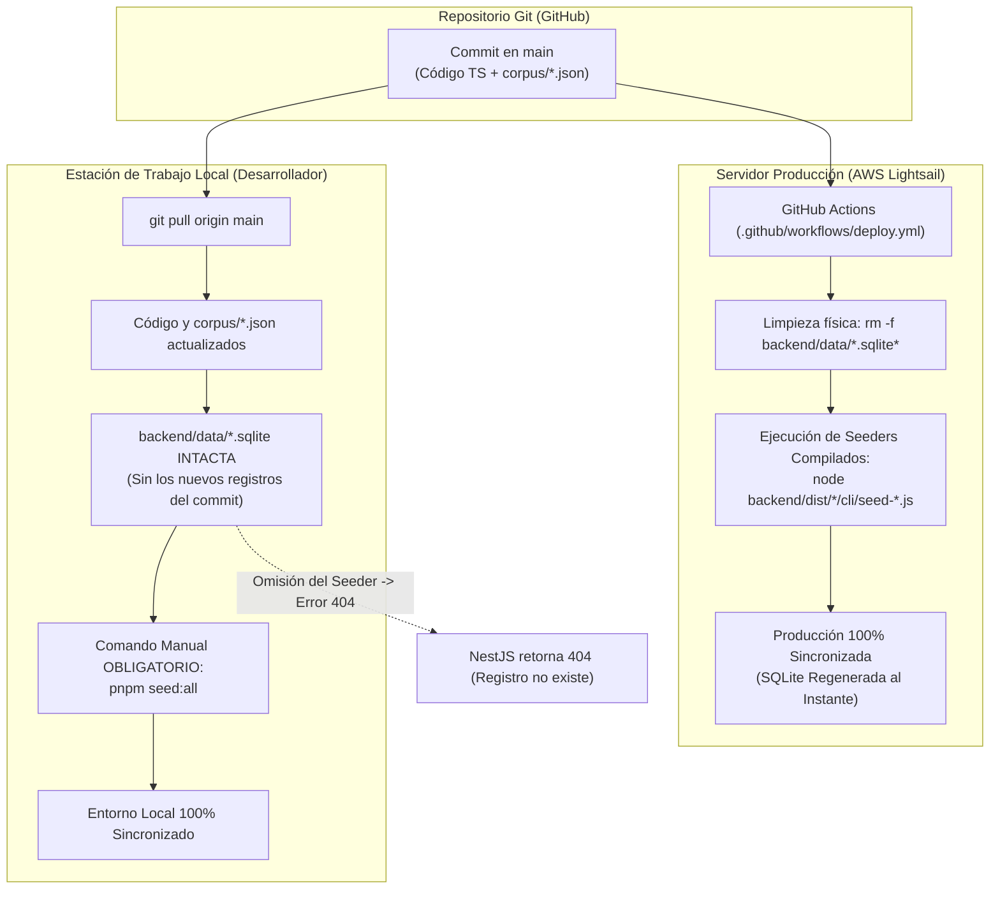

# Persistencia Local SQLite, Sincronización Multiequipo y Protocolo de Diagnóstico 404

Este documento establece las directrices de ingeniería para la gestión de bases de datos SQLite locales en entornos de desarrollo multiequipo, la divergencia controlada frente al pipeline de CI/CD en producción y el protocolo técnico obligatorio para el diagnóstico de errores 404 en rutas dinámicas.

---

## 1. Fundamentos de Persistencia y Seguridad

El ecosistema Jorge Doicela implementa persistencia desacoplada mediante tres bases de datos físicas independientes ubicadas en `backend/data/`:
* `backend/data/bible.sqlite` (`'bibleConnection'`)
* `backend/data/software.sqlite` (`'softwareConnection'`)
* `backend/data/portfolio.sqlite` (`'portfolioConnection'`)

### 1.1 Exclusión Obligatoria de Control de Versiones
> [!IMPORTANT]
> **Seguridad y Aislamiento de Binarios:**  
> Ningún archivo `.sqlite`, `.sqlite-wal`, `.sqlite-shm` o `.sqlite-journal` viaja en Git. Están estrictamente ignorados en `.gitignore` y auditados en cada commit por el script de seguridad pre-commit de Husky (`pnpm check-secrets`).  
> La **única fuente de verdad** compartida en el repositorio para los datos iniciales y editoriales son los archivos estructurados en los submódulos de corpus (ej. `backend/src/software/corpus/*.json`).

---

## 2. Divergencia de Ciclo de Vida: Producción (CI/CD) vs. Desarrollo Local

La discrepancia operativa fundamental entre el servidor de producción y las estaciones de trabajo locales radica en la automatización del seeder:



### 2.1 En Producción (Automático e Idempotente)
El pipeline de CI/CD ([deploy.yml](file:///c:/Users/jorge/Desktop/Proyectos/jorge_doicela/.github/workflows/deploy.yml)) ejecuta de forma no negociable por SSH:
```bash
# 1. Limpieza física previa
rm -f backend/data/*.sqlite* 2>/dev/null || true

# 2. Reconstrucción atómica y seeding desde los corpus JSON compilados
node backend/dist/bible/cli/seed-corpus.js
node backend/dist/software/cli/seed-software.js
node backend/dist/portfolio/cli/seed-portfolio.js
```
Por este motivo físico, el servidor de producción **siempre cuenta con todas las tablas, columnas, artículos y términos de glosario actualizados**.

### 2.2 En Desarrollo Local (Manual e Imperativo)
Al clonar el repositorio, cambiar de máquina o realizar un `git pull` de commits que introducen nuevas publicaciones, términos o entidades:
* El código fuente de TypeScript se actualiza.
* Los datasets JSON en `corpus/*.json` se actualizan.
* **Las bases de datos SQLite locales NO se actualizan automáticamente** porque los binarios locales permanecen intactos en disco.

---

## 3. Checklist Obligatorio de Sincronización Multiequipo

Cada vez que un desarrollador o agente cambie de estación de trabajo o haga `git pull` de la rama `main`, debe ejecutar el siguiente ciclo operativo antes de iniciar los servidores:

```bash
# 1. Instalar dependencias si el lockfile cambió
pnpm install

# 2. Aprovisionar y sincronizar todas las bases de datos locales SQLite
pnpm seed:all

# 3. O de forma granular según el dominio en desarrollo:
pnpm seed:software     # Sincroniza software.sqlite (8 módulos + glosario)
pnpm seed:bible        # Sincroniza bible.sqlite (versiones y lemas Strong)
pnpm --filter backend seed:portfolio # Sincroniza portfolio.sqlite

# 4. Iniciar los entornos en paralelo
pnpm dev
```

---

## 4. Protocolo Profesional de Diagnóstico ante Errores 404

Cuando una ruta dinámica de contenido (ej. `http://software.localhost:3001/infrastructure/[slug]`) devuelva `404 Not Found` en un entorno de desarrollo local, todo ingeniero o agente de IA debe aplicar de forma rigurosa el siguiente árbol de decisión:

```text
                                [ Error 404 Not Found en Navegador ]
                                                 │
                                                 v
                     ¿El registro existe en la base de datos local SQLite?
                     (Ej. Consulta con sqlite3 o better-sqlite3 al archivo)
                                                 │
                                 ┌───────────────┴───────────────┐
                                 │ NO                            │ SÍ
                                 v                               v
                     [ CAUSA IDENTIFICADA ]             ¿El endpoint de NestJS
                     La base local no fue               responde 200 con curl?
                     sembrada tras git pull.            curl http://127.0.0.1:3000/api/...
                                 │                               │
                                 v                       ┌───────┴───────┐
                     Ejecutar:                           │ NO            │ SÍ
                     pnpm seed:software                  v               v
                     (PROBLEMA RESUELTO)         Revisar Controller /   Revisar ServerFetch
                                                 Query en NestJS        o Server Component
```

### Reglas Inviolables de Diagnóstico:
1. **Prohibido asumir bugs en Middleware o Routing:** Queda terminantemente prohibido modificar `src/middleware.ts`, layouts o lógica de Server Components de Next.js ante un 404 de contenido editorial sin haber verificado primero la persistencia física.
2. **El 404 es la respuesta correcta ante un dato inexistente:** Si la base de datos no contiene el registro, el backend NestJS **debe responder 404** y el Server Component de Next.js **debe invocar `notFound()`**. Intentar forzar una respuesta en el frontend enmascara la ausencia del dato y crea deuda técnica silenciosa.
3. **Verificación Directa del Endpoint:** Antes de sospechar del renderizado de React, audita la API directamente con curl:
   ```bash
   # Debe responder {"success": true, "data": { ... }}
   curl -i "http://127.0.0.1:3000/api/software/infrastructure/<slug>?lang=es"
   ```

---

## 5. Divergencia de Runtimes: `next dev` vs. `next start` (Standalone)

Es fundamental comprender la diferencia arquitectónica entre el entorno local de desarrollo y el servidor de producción para interpretar correctamente la consola del desarrollador:

| Dimensión | Desarrollo Local (`next dev`) | Producción Standalone (`next start`) |
|---|---|---|
| **Motor de Bundling** | Turbopack en desarrollo activo | Next.js Standalone precompilado |
| **Variable `NODE_ENV`** | `development` | `production` |
| **`React.StrictMode`** | **Activo:** Ejecuta dobles pasadas de renderizado para detectar impurezas y efectos colaterales. | **Inactivo:** Renderizado lineal único de máxima velocidad. |
| **Warnings de Consola** | Reporta advertencias estrictas de React 19 (scripts dentro de componentes, tags de hidratación). | React suprime advertencias de desarrollo y recupera discrepancias menores en milisegundos. |
| **Overlays de Error** | Pantalla roja modal de Next.js ante excepciones no capturadas. | Páginas de error limpias (`500.html`, `404.html`) sin fugas de stack trace. |

> [!TIP]
> Si una funcionalidad opera con fluidez en producción pero emite advertencias en el navegador local, la causa suele ser la estrictez deliberada del modo `development` de React 19 / Turbopack. Las soluciones deben buscar siempre la pureza funcional del componente, sin degradar el código de producción con parches apresurados.
