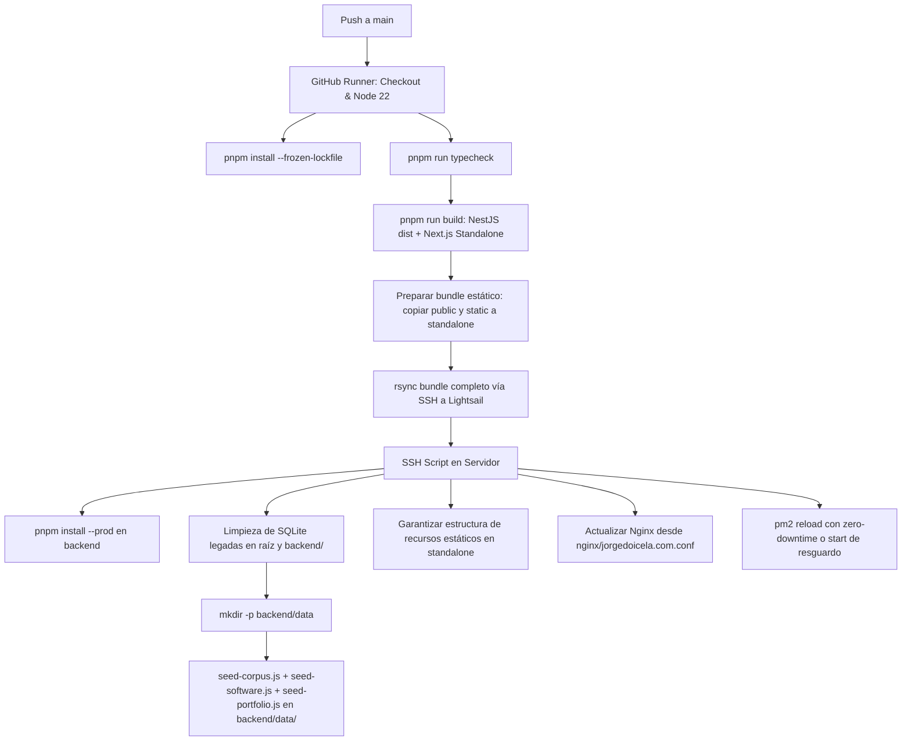

# Despliegue en Servidor, PM2, CI/CD, Nginx y Hooks de Seguridad

Este documento detalla la infraestructura de despliegue completa, la preparación del sistema operativo en **AWS Lightsail (Debian 13)**, la plantilla viva de **Nginx** (`nginx/`), la suite de seguridad pre-commit (**Husky** y `scripts/check-secrets.js`), la orquestación de procesos con **PM2** y el pipeline automatizado de **GitHub Actions** (`.github/workflows/deploy.yml`).

---

## 1. Seguridad Local y Hooks de Pre-Commit (`.husky/` y `scripts/`)

Para evitar fugas de información confidencial o subidas de código con errores al repositorio, el monorepo implementa un ciclo de validación estricto antes de cada `git commit`:

### 1.1 Hook Pre-Commit (`.husky/pre-commit`)
```bash
pnpm check-secrets && pnpm lint-staged && pnpm typecheck
```
* **`pnpm check-secrets`:** Ejecuta el script de auditoría de seguridad `scripts/check-secrets.js`.
* **`pnpm lint-staged`:** Aplica formateo y reglas de ESLint/Prettier exclusivamente a los archivos preparados (*staged*).
* **`pnpm typecheck`:** Valida la consistencia estricta de tipos en TypeScript (`tsc --noEmit`) en todos los workspaces. Si hay un solo error tipográfico, el commit es abortado.

### 1.2 Auditor de Fugas de Información (`scripts/check-secrets.js`)
Script en Node.js que inspecciona los archivos staged mediante expresiones regulares para bloquear el commit si detecta:
* **Archivos prohibidos:** `.env*`, `.pem`, `.key`, `.crt`, `.pfx`, `.p12`, `id_rsa*` y bases de datos locales `*.sqlite`.
* **Patrones de secretos en código (+):**
  * Bloques `BEGIN PRIVATE KEY` (SSH, RSA, EC, PGP).
  * Llaves de AWS (`AKIA[0-9A-Z]{16}`).
  * Llaves de Google API (`AIza[0-9A-Za-z_-]{35}`).
  * Tokens personales de GitHub (`ghp_*`, `github_pat_*`).
  * Cadenas de conexión con usuario y contraseña (`mongodb://`, `postgres://`, `mysql://`, `redis://`).
  * Tokens de Slack, Stripe, SendGrid y JWT sospechosos.

---

## 2. Preparación del Servidor (Debian 13 en AWS Lightsail)

### 2.1 Herramientas del Sistema y Compilación C++
El driver de SQLite de alto rendimiento `better-sqlite3` compila extensiones nativas en C++:
```bash
sudo apt update
sudo apt install -y build-essential python3 g++ make rsync nginx curl git
```

### 2.2 Instalación de Node.js v22 LTS, pnpm y PM2
```bash
curl -fsSL https://deb.nodesource.com/setup_22.x | sudo -E bash -
sudo apt install -y nodejs
sudo npm install -g pnpm pm2
```

### 2.3 Memoria de Intercambio (Swap de 2 GB)
Indispensable para absorber la sobrecarga de instalación de dependencias en el VPS de 1 GB de RAM:
```bash
sudo fallocate -l 2G /swapfile
sudo chmod 600 /swapfile
sudo mkswap /swapfile
sudo swapon /swapfile
echo '/swapfile none swap sw 0 0' | sudo tee -a /etc/fstab
```

### 2.4 Permisos del Sistema Operativo para Nginx (`www-data`)
Para permitir que Nginx (`www-data`) acceda y sirva los archivos estáticos compilados ubicados en `/home/admin/jorge_doicela/`:
```bash
chmod 755 /home/admin
```

---

## 3. Plantilla Viva de Nginx (`nginx/jorgedoicela.com.conf`)

La configuración del servidor web está versionada directamente en el repositorio bajo `nginx/jorgedoicela.com.conf`. El pipeline de CI/CD se encarga de sincronizarla automáticamente con el servidor en cada despliegue.

```nginx
# Redirección HTTP -> HTTPS
server {
    listen 80;
    listen [::]:80;
    server_name jorgedoicela.com *.jorgedoicela.com;
    return 301 https://$host$request_uri;
}

# Servidor HTTPS con Certificados de Cloudflare y mTLS
server {
    listen 443 ssl;
    listen [::]:443 ssl;
    http2 on;
    server_name jorgedoicela.com *.jorgedoicela.com;

    # Certificados de Origen de Cloudflare
    ssl_certificate /etc/ssl/certs/origin.pem;
    ssl_certificate_key /etc/ssl/private/private.key;

    # Authenticated Origin Pulls (Validación mutua TLS)
    ssl_client_certificate /etc/ssl/certs/cloudflare.crt;
    ssl_verify_client on;

    error_page 496 =444 @cerrar_conexion;
    location @cerrar_conexion { return 444; }

    ssl_protocols TLSv1.2 TLSv1.3;
    ssl_prefer_server_ciphers on;
    server_tokens off;

    # Cabeceras de Seguridad
    add_header X-Frame-Options "SAMEORIGIN" always;
    add_header X-Content-Type-Options "nosniff" always;
    add_header Referrer-Policy "strict-origin-when-cross-origin" always;

    # Compresión Gzip
    gzip on;
    gzip_comp_level 6;
    gzip_min_length 256;
    gzip_proxied any;
    gzip_types text/plain text/css application/json application/javascript text/xml application/xml image/svg+xml;

```nginx
# Mapa dinámico de enrutamiento: Peticiones de navegación de páginas web HTML van al frontend Next.js (3001),
# mientras que peticiones de datos de la API REST (JSON) van al backend NestJS (3000).
map $http_accept $backend_port {
    default                 3000;
    ~*text/html             3001;
}

# Mapa de archivos llms.txt especializados por subdominio (Zero-RAM en Nginx)
map $host $llms_file {
    default                 /home/admin/jorge_doicela/frontend/web/public/landing/llms.txt;
    ~*portfolio\.           /home/admin/jorge_doicela/frontend/web/public/portfolio/llms.txt;
    ~*software\.            /home/admin/jorge_doicela/frontend/web/public/software/llms.txt;
    ~*bible\.               /home/admin/jorge_doicela/frontend/web/public/bible/llms.txt;
}

# Mapa de manifiestos PWA independientes por subdominio
map $host $manifest_file {
    default                 /home/admin/jorge_doicela/frontend/web/public/landing/manifest.json;
    ~*portfolio\.           /home/admin/jorge_doicela/frontend/web/public/portfolio/manifest.json;
    ~*software\.            /home/admin/jorge_doicela/frontend/web/public/software/manifest.json;
    ~*bible\.               /home/admin/jorge_doicela/frontend/web/public/bible/manifest.json;
}

# Mapa de favicons e iconos independientes por subdominio
map $host $favicon_file {
    default                 /home/admin/jorge_doicela/frontend/web/public/landing/logo/logo_fondo_circular_color_.png;
    ~*portfolio\.           /home/admin/jorge_doicela/frontend/web/public/portfolio/logo/logo_fondo_circular_color_.png;
    ~*software\.            /home/admin/jorge_doicela/frontend/web/public/software/logo/logo_fondo_circular_color_.png;
    ~*bible\.               /home/admin/jorge_doicela/frontend/web/public/bible/logo/logo_fondo_circular_color_.png;
}

server {
    ...
    # 1. API REST Backend NestJS / Frontend Next.js - Desacoplamiento inteligente por Accept Header
    location ~ ^/(bible/(verses|translations|morphology|books|historical)|software/(ai|blog|cybersecurity|forum|news|projects|tutorials)|portfolio/contact) {
        proxy_pass http://127.0.0.1:$backend_port;
        proxy_http_version 1.1;
        proxy_set_header Upgrade $http_upgrade;
        proxy_set_header Connection 'upgrade';
        proxy_set_header Host $host;
        proxy_cache_bypass $http_upgrade;
        proxy_set_header X-Real-IP $remote_addr;
        proxy_set_header X-Forwarded-For $proxy_add_x_forwarded_for;
    }

    # 2. WebSockets de la Terminal SSH (Socket.io)
    location /socket.io/ {
        proxy_pass http://127.0.0.1:3000;
        proxy_http_version 1.1;
        proxy_set_header Upgrade $http_upgrade;
        proxy_set_header Connection "Upgrade";
        proxy_set_header Host $host;
        proxy_set_header X-Real-IP $remote_addr;
        proxy_set_header X-Forwarded-For $proxy_add_x_forwarded_for;
    }

    # 3. Next.js Static Assets servidos directamente por Nginx (Alto Rendimiento y Cero Errores MIME)
    location ^~ /_next/static/ {
        alias /home/admin/jorge_doicela/frontend/web/.next/static/;
        expires 365d;
        access_log off;
        add_header Cache-Control "public, max-age=31536000, immutable";
    }

    # 4. Logos y Assets Públicos de los 4 Proyectos
    location ^~ /landing/ {
        alias /home/admin/jorge_doicela/frontend/web/public/landing/;
        expires 30d;
        access_log off;
        add_header Cache-Control "public, max-age=2592000, immutable";
    }

    location ^~ /bible/logo/ {
        alias /home/admin/jorge_doicela/frontend/web/public/bible/logo/;
        expires 30d;
        access_log off;
        add_header Cache-Control "public, max-age=2592000, immutable";
    }

    location ^~ /software/logo/ {
        alias /home/admin/jorge_doicela/frontend/web/public/software/logo/;
        expires 30d;
        access_log off;
        add_header Cache-Control "public, max-age=2592000, immutable";
    }

    location ^~ /portfolio/logo/ {
        alias /home/admin/jorge_doicela/frontend/web/public/portfolio/logo/;
        expires 30d;
        access_log off;
        add_header Cache-Control "public, max-age=2592000, immutable";
    }

    location = /manifest.json {
        alias $manifest_file;
        expires 1d;
        access_log off;
        add_header Cache-Control "public, max-age=86400, stale-while-revalidate=604800";
    }

    location = /llms.txt {
        alias $llms_file;
        expires 7d;
        access_log off;
        add_header Cache-Control "public, max-age=604800, stale-while-revalidate=86400";
    }

    location = /favicon.ico {
        alias $favicon_file;
        expires 30d;
        access_log off;
    }

    # 5. Next.js Frontend Standalone (Puerto 3001) - Páginas, RSC y Rutas Dinámicas
    location / {
        proxy_pass http://127.0.0.1:3001;
        proxy_http_version 1.1;
        proxy_set_header Upgrade $http_upgrade;
        proxy_set_header Connection 'upgrade';
        proxy_set_header Host $host;
        proxy_cache_bypass $http_upgrade;
        proxy_set_header X-Real-IP $remote_addr;
        proxy_set_header X-Forwarded-For $proxy_add_x_forwarded_for;
    }
}
```

---

## 4. Orquestación de Procesos con PM2 (`pm2.config.js`)

Controla el ciclo de vida y los límites de memoria de los procesos unificados en el VPS:
* **`backend-nest`:** Inicia `./dist/main.js` desde `./backend` (puerto `3000`). Límite de reinicio: `200 MB`.
* **`frontend-next`:** Inicia `./server.js` con `cwd` en `./frontend/web/.next/standalone/frontend/web` (puerto `3001`). Límite de reinicio: `200 MB`. Consumo real promedio: **~90 MB**.

```bash
# Comandos de gestión PM2:
pm2 list
pm2 reload pm2.config.js --update-env
pm2 logs --lines 100
pm2 save
```

---

## 5. Pipeline CI/CD Automatizado (`.github/workflows/deploy.yml`)

El pipeline se dispara automáticamente ante cada `git push` a la rama `main` y realiza todo el trabajo pesado en los servidores de GitHub para no consumir CPU ni RAM del VPS de 1 GB:



### 5.1 Fases del Pipeline:
1. **Instalación y Caché:** Instala con pnpm utilizando la caché de la tienda local (`~/.local/share/pnpm/store`).
2. **Validación y Compilación:** Ejecuta `pnpm run typecheck` y `pnpm run build` en el runner de GitHub.
3. **Empaquetado de Assets Standalone:** Copia `public/` y `.next/static/` directamente a `.next/standalone/frontend/web/` en el runner de GitHub Actions para que el bundle viaje completo y listo para producción sin sobrecargar la CPU del servidor.
4. **Transferencia Segura (`easingthemes/ssh-deploy`):** Sincroniza los archivos vía rsync excluyendo `.git`, `node_modules` y bases de datos `*.sqlite`.
5. **Post-Despliegue en el Servidor (`appleboy/ssh-action`):**
   * Instala dependencias de producción en `backend/` (`--prod --ignore-scripts`).
   * **Limpieza de archivos legados:** Elimina cualquier `*.sqlite` que haya quedado en la raíz del monorepo o directamente en `backend/` (estructura anterior a la migración `backend/data/`).
   * **Asegura el directorio canónico:** `mkdir -p backend/data` garantiza que el directorio exista incluso en clones limpios del servidor.
   * **Siembra los 3 módulos:** Ejecuta `seed-corpus.js`, `seed-software.js` y `seed-portfolio.js`, que resolverán sus rutas deterministas a `backend/data/` mediante `resolveDatabasePath`.
   * Verifica la integridad de los recursos estáticos en `standalone/`.
   * **Construcción del Docker Sandbox:** Construye `portfolio-sandbox:latest` desde `backend/src/portfolio/docker/` si existen cambios, aprovechando el caché de capas de Docker en el VPS (< 1s).
   * **Permisos del Docker Socket:** Asegura que el usuario `admin` pertenezca al grupo `docker` y ajusta permisos a `0660 /var/run/docker.sock` para que el proceso NestJS en PM2 opere contenedores sin `sudo`.
   * Si existe `nginx/jorgedoicela.com.conf`, lo copia a `/etc/nginx/sites-available/` y recarga Nginx sin caída (`sudo nginx -t && sudo systemctl reload nginx`).
   * Recarga los procesos sin caída del servicio usando `pm2 reload pm2.config.js --update-env || pm2 start pm2.config.js`.

### 5.2 Secretos de GitHub Requeridos:
* `SSH_PRIVATE_KEY`: Llave privada SSH para autenticarse en AWS Lightsail.
* `REMOTE_HOST`: IP estática del VPS.
* `REMOTE_USER`: Usuario del sistema operativo (ej. `admin` o `debian`).
* `TARGET_DIR`: Ruta absoluta en el servidor (ej. `/var/www/jorgedoicela`).
