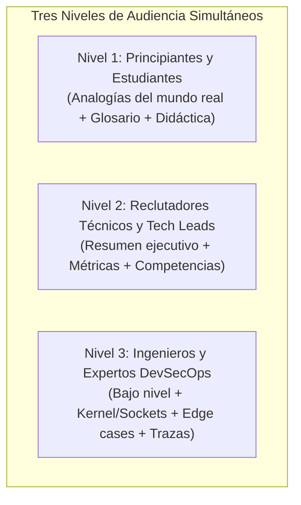

# Software - Estándares Editoriales, Pedagogía Multinivel y Reglas de Redacción

Este documento define las directrices editoriales mandatorias para la creación, revisión y publicación de contenidos técnicos en los 8 módulos de **Software** (`software.jorgedoicela.com`).

---

## 1. Filosofía Editorial: Rigor Técnico sin Hype ni Marketing

En toda la plataforma de Software rige un principio fundamental: **Ingeniería Sobria y Objetiva**.

### 1.1 Prohibición Estricta de Palabras Marketineras y Superlativos Vacíos
Queda terminantemente prohibido utilizar términos sensacionalistas, publicitarios o de venta vacía, tales como:
* ❌ *"El mejor"* / *"La mejor"*
* ❌ *"La solución definitiva"*
* ❌ *"Increíble"* / *"Asombroso"*
* ❌ *"Revolucionario"*
* ❌ *"Mágico"*
* ❌ *"Perfecto"* / *"Insuperable"*

### 1.2 Enfoque de Reemplazo Profesional
Toda afirmación debe basarse en arquitectura, pruebas y mediciones empíricas:
* En lugar de *"El mejor firewall para servidores"*, escribir: *"Arquitectura de filtrado en espacio de kernel para servidores Linux"*.
* En lugar de *"La solución definitiva al conflicto con Docker"*, escribir: *"Resolución arquitectónica del conflicto de reglas entre Docker y UFW"*.
* En lugar de *"Una herramienta increíble y mágica"*, escribir: *"Utilidad de bajo impacto en memoria (< 5 MB) con ejecución en espacio de kernel"*.

### 1.3 Cero Meta-Etiquetas de Audiencia (No Clasificar Explícitamente al Lector)
* **Regla de Oro Periodística y de Ingeniería:** Un medio o publicación de alta reputación (como *The New York Times*, *IEEE Software*, *Stripe Engineering* o *Cloudflare Blog*) jamás le dice en la cara a su lector: *"este párrafo es para millonarios"* o *"esta sección es para líderes/reclutadores"*.
* **Prohibición de Etiquetas:** Queda terminantemente prohibido incluir encabezados o textos que digan:
  * ❌ *"Para reclutadores"* / *"Para Tech Leads"*
  * ❌ *"Para principiantes"* / *"Para estudiantes"*
  * ❌ *"Para expertos"* / *"Para seniors"*
* **Tratamiento Universal y Elegante:** La pedagogía multinivel es un criterio de **diseño interior** del artículo. Los títulos deben ser sobrios y universales:
  * En lugar de *"Resumen Ejecutivo para Reclutadores"*, titular simplemente: `**Resumen Ejecutivo:**`.
  * En lugar de *"Analogía Intuitiva para Principiantes"*, titular: `## Modelo Conceptual: Anatomía del Perímetro de Red`.
  * En lugar de *"Sección Avanzada para Expertos"*, titular: `## Diagnóstico de Bajo Nivel y Parámetros de Kernel`.
  El lector experimentado apreciará el rigor sin sentirse condescendido, y el lector aprendiz comprenderá los conceptos sin sentirse subestimado.

---

## 2. Arquitectura Pedagógica Multinivel

Toda publicación debe diseñarse con capas de lectura para que **cualquier perfil técnico** obtenga valor inmediato:

### 2.1 Para Principiantes y Estudiantes (Aprender desde Cero)
* **Analogías del Mundo Real:** Abrir con comparaciones cotidianas e intuitivas (ej. el edificio corporativo, la aduana, la central telefónica) antes de entrar en líneas de comando.
* **Glosario de Conceptos Fundamentales:** Definir con precisión y sin asumir saberes previos términos como *Socket, Bind Address, Handshake TCP, Conntrack, Buffer*.
* **El "Por Qué" antes del Código:** Explicar qué hace cada comando y qué problema previene antes de pedirle al usuario que lo ejecute.

### 2.2 Para Reclutadores Técnicos y Hiring Managers (Validar Seniority en 60 Segundos)
* **Resumen Ejecutivo Superior:** Destacar el problema de infraestructura o software resuelto, el enfoque de diseño y el impacto cuantitativo (ej. 0 ms CPU drop, 99.9% de reducción de ruido).
* **Checklist de Competencias Demostradas:** Lista estructurada al final que sintetiza las capacidades técnicas exhibidas en la publicación.

### 2.3 Para Desarrolladores Seniors y Especialistas (Aprender Cosas Nuevas y Avanzadas)
* **Diagnóstico de Bajo Nivel:** Inspección real de sockets (`ss -tlnp`, `lsof`), paquetes de kernel (Netfilter hooks), parámetros del kernel (`sysctl.d`).
* **Resolución de Conflictos y Casos Límite (Edge Cases):** Abordar problemas reales que la documentación oficial suele omitir (ej. bypass de iptables con Docker, soporte Dual-Stack IPv6 descuidado).
* **Auditoría Forense y Verificación:** Tácticas de validación externa (ej. escaneo sigiloso con Nmap, análisis de flags TCP `SYN`, `RST`, estados `filtered`).

---

## 3. Estructura Estándar de una Publicación

Toda publicación en cualquiera de las 8 categorías (`infrastructure`, `tutorials`, `blog`, `news`, `security`, `ai`, `projects`, `forum`) debe estructurarse con la siguiente progresión:

1. **Título Técnico y Subtítulo Descriptivo:** Sin adjetivos grandilocuentes.
2. **Resumen Ejecutivo (Callout `[!IMPORTANT]`):** Problema, arquitectura y métricas de impacto.
3. **Analogía Intuitiva o Marco Conceptual:** Para nivelación didáctica inmediata.
4. **Glosario de Términos:** Tabla de conceptos clave.
5. **Desarrollo Técnico Progresivo:**
   * Diagnóstico inicial.
   * Procedimiento seguro (prevención de incidentes / fallos de configuración).
   * Configuración paso a paso con bloques de código comentados.
   * Resolución de casos de borde y edge cases.
   * Endurecimiento avanzado o buenas prácticas de producción.
6. **Auditoría y Comandos Operativos:** Tablas de referencia rápida de comandos y monitoreo.
7. **Conclusión y Checklist de Validación:** Lista de verificación interactiva (`[x]`).

---

## 4. Bilingüismo Simétrico Obligatorio

* Toda publicación debe redactarse simultáneamente en español (`es`) e inglés (`en`).
* Ambas versiones deben tener la misma calidad gramatical, el mismo rigor técnico y compartir los mismos diagramas Mermaid y tablas de especificaciones.
* Los archivos se preparan en:
  * `frontend/web/src/app/(software)/entities/<categoria>/drafts/es.<slug>.md`
  * `frontend/web/src/app/(software)/entities/<categoria>/drafts/en.<slug>.md`
* Y se sincronizan con `backend/src/software/corpus/<categoria>.json`.

---

## 5. Jerarquía Semántica y Pureza del Cuerpo Markdown (Regla de Oro H1 / DRY)

* **El Título Vive en los Metadatos:** En cumplimiento de la regla de *Fuente Única de Verdad (SSOT)* y estándares W3C/WCAG 2.1 (un único `<h1>` por documento), el título y subtítulo se almacenan exclusivamente en las columnas relacionales `title` y `subtitle` (o `excerpt`/`description`).
* **Cuerpo Markdown Puro (`contentMarkdown`):** Los archivos de borrador `.md` y el campo `contentMarkdown` en el corpus **nunca deben comenzar con `# Título`**, ya que el componente de cabecera de la página (`SoftwareArticleLayout`) es el dueño canónico del `<h1>`.
* **Estructura de Encabezados Interna:** El cuerpo del artículo debe arrancar directamente con el bloque de introducción o resumen ejecutivo (`> [!IMPORTANT]`), y todas las secciones principales deben emplear exclusivamente nivel 2 (`## Título de Sección`), subsecciones nivel 3 (`### Paso o Concepto`) y sub-bloques nivel 4 (`#### Detalle`).

