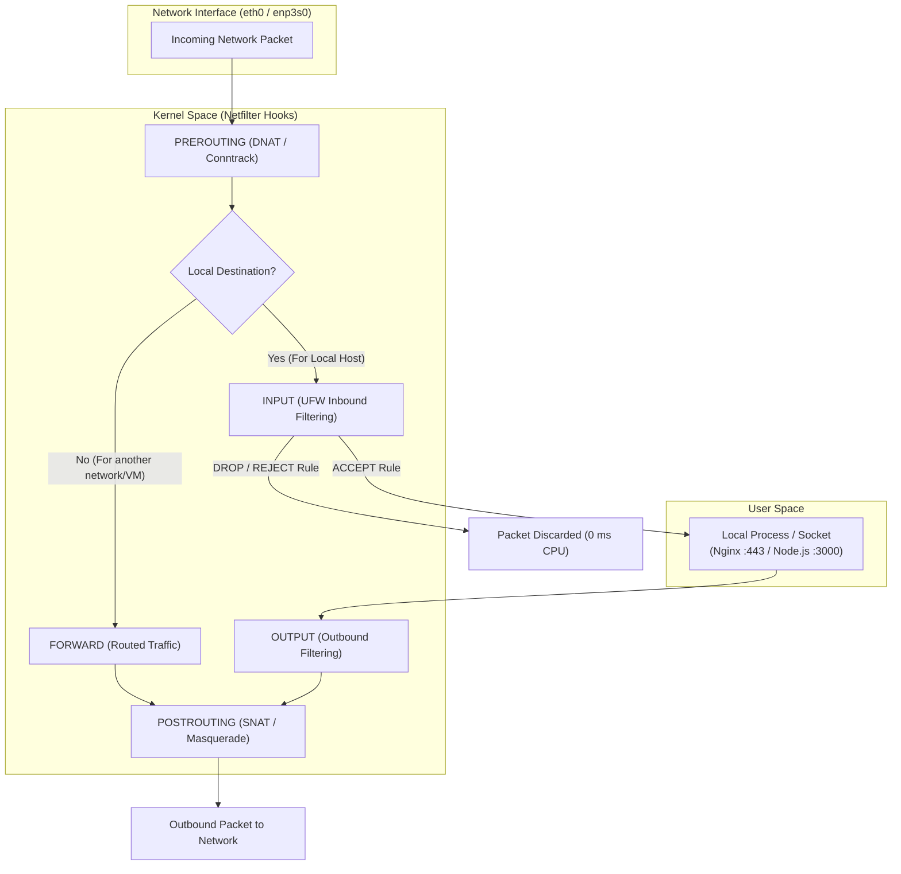

# Linux Firewalls: From Netfilter and UFW to Server Perimeter Security

## Architectural Overview
A Linux firewall is not an isolated user-space program, but a collection of packet inspection directives executed directly by the **Netfilter** framework inside the kernel space. This technical guide details the full progression required to configure, govern, and audit the perimeter security of a Linux server (Debian/Ubuntu), covering foundational TCP/IP packet traversal and local socket diagnosis, declarative rule management with **UFW** (*Uncomplicated Firewall*), advanced brute-force mitigation using **fail2ban**, container socket isolation with **Docker**, and low-level kernel networking hardening via **sysctl**.

---

## 1. Fundamentals: How Firewalls Operate in the Linux Kernel

Packet filtering in Linux occurs directly at the kernel layer through **Netfilter**, a modular framework that intercepts network packets across five key hook points within the operating system's networking stack:



### The Abstraction Hierarchy in Linux

1. **Netfilter (Kernel Space):** Real-time kernel engine executing packet verdicts (`ACCEPT`, `DROP`, `REJECT`).
2. **iptables / nftables (User Space CLI):** Low-level user-space utilities used to construct tables (`filter`, `nat`, `mangle`) and custom chains.
3. **UFW (Uncomplicated Firewall):** High-level management frontend created by Canonical to streamline iptables and nftables rule manipulation without complex table syntax.

> [!NOTE]
> When an unauthorized packet is intercepted and dropped using the `DROP` target in the `INPUT` chain, the kernel discards the packet memory structure instantly. User-space applications (Node.js, PostgreSQL, Nginx) never receive a network hardware interrupt, saving critical CPU cycles and system memory.

---

## 2. Initial Diagnosis: Inspecting Sockets and Open Ports

Before declaring any firewall rule, administrators must systematically inspect which processes and network sockets are actively listening on the host.

### Socket Inspection Command with `ss`

```bash
# Terminal / Output
sudo ss -tlnp
```

The `-tlnp` flags break down as follows:
* `-t`: TCP protocol.
* `-l`: Sockets in the listening state (*LISTEN*).
* `-n`: Display numeric port numbers instead of resolving service names.
* `-p`: Display process identifier (PID) and executable name.

```text
State    Recv-Q   Send-Q     Local Address:Port      Peer Address:Port   Process
LISTEN   0        511              0.0.0.0:80             0.0.0.0:*       users:(("nginx",pid=1240,fd=6))
LISTEN   0        128              0.0.0.0:22             0.0.0.0:*       users:(("sshd",pid=890,fd=3))
LISTEN   0        511            127.0.0.1:3000           0.0.0.0:*       users:(("node",pid=3412,fd=19))
LISTEN   0        128            127.0.0.1:5432           0.0.0.0:*       users:(("postgres",pid=1520,fd=7))
```

### Socket Bind Address Anatomy

| Local Address | Definition | Risk Without Firewall |
|---|---|---|
| `0.0.0.0` / `[::]` | The process listens on **all available network interfaces** (public, private, and loopback). | **Critical:** Any external internet client can reach the socket if unblocked by the kernel firewall. |
| `127.0.0.1` / `[::1]` | The process is bound strictly to the **internal loopback interface**. | **Low:** Only local processes running on the same operating system can communicate with the socket. |
| `192.168.1.50` | The process is bound exclusively to the Local Area Network (LAN) physical interface. | **Medium:** Reachable only by devices within the same local network subnet. |

---

## 3. Remote Lockout Prevention (Safe SSH Configuration)

The most critical operational mistake when provisioning remote servers (cloud VPS or remote hardware) is enabling UFW before declaring an explicit rule permitting SSH traffic.

> [!CRITICAL]
> **Strict Operational Sequence:**  
> Never execute `sudo ufw enable` without first running `sudo ufw allow ssh` (or your custom SSH port). If UFW is enabled with the default `deny incoming` policy, your active SSH session will terminate immediately and administrative access will be lost permanently.

### Emergency Recovery Timer (Recommended for Remote Upgrades)

When configuring mission-critical remote servers, schedule an automated background deactivation timer before turning on the firewall:

```bash
# Automatically disables UFW after 5 minutes unless manually aborted
sudo bash -c "sleep 300 && ufw disable" &
```

If your subsequent SSH connection test in a separate terminal window succeeds, kill the background `sleep` process using `kill`.

---

## 4. Base Configuration: Principle of Least Privilege (*Default Deny*)

A hardened perimeter operates under an explicit allowlist philosophy: deny all incoming traffic by default and open only verified ports.

```bash
# 1. Update package index and install UFW on Debian / Ubuntu
sudo apt update && sudo apt install -y ufw

# 2. Default incoming policy: Drop all incoming traffic
sudo ufw default deny incoming

# 3. Default outgoing policy: Allow outbound traffic (package managers, DNS, updates)
sudo ufw default allow outgoing

# 4. Default routed policy: Drop routed traffic between network interfaces
sudo ufw default deny routed

# 5. MANDATORY PRE-REQUISITE: Allow SSH access (TCP port 22)
sudo ufw allow 22/tcp comment 'SSH administrative access'

# 6. Enable the firewall
sudo ufw enable
```

```text
# Terminal / Output
Command may disrupt existing ssh connections. Proceed with operation (y|n)? y
Firewall is active and enabled on system startup
```

---

## 5. Granular Rule Declaration Across Environments

### 5.1 Public Web Servers (Production Cloud Instances)

On internet-facing web servers running HTTP/HTTPS reverse proxies:

```bash
# Allow standard HTTP traffic (port 80) for ACME challenges and SSL redirects
sudo ufw allow 80/tcp comment 'HTTP Nginx'

# Allow encrypted HTTPS traffic (port 443)
sudo ufw allow 443/tcp comment 'HTTPS Nginx with TLS'
```

### 5.2 Local Hardware & On-Premises Servers (Home Labs / Office Networks)

When managing dedicated hardware or home servers where SSH should never be exposed to the public internet, restrict access to your local private subnet:

```bash
# Allow SSH access strictly from devices on the 192.168.1.0/24 subnet
sudo ufw allow from 192.168.1.0/24 to any port 22 proto tcp comment 'SSH local LAN'

# Allow administrative access from a designated static workstation IP
sudo ufw allow from 192.168.1.15 to any port 22 proto tcp comment 'SSH Admin Laptop'
```

### 5.3 Built-in UFW Rate Limiting

UFW provides built-in connection rate limiting designed to mitigate automated SSH dictionary and brute-force attacks:

```bash
# Blocks IP addresses attempting 6 or more connections within a 30-second window
sudo ufw limit 22/tcp comment 'SSH connection rate limiting'
```

---

## 6. Docker Networking Integration and Service Isolation

> [!WARNING]
> **Docker and `iptables` Rule Bypass:**  
> By default, the Docker daemon (`dockerd`) directly modifies `iptables` chains in the `nat` table and `DOCKER-USER` chain. If you start a container using `-p 8080:8080`, Docker inserts a routing rule in Netfilter that **completely bypasses UFW inbound rules**.

### Best Practices for Containers and Databases:

1. **Explicitly Bind to Loopback in Docker Compose / CLI:**
   ```yaml
   # docker-compose.yml
   ports:
     - "127.0.0.1:5432:5432"  # Secure: Accessible strictly from the local host
     # Instead of "5432:5432" which inadvertently exposes the database to the public internet
   ```
2. **Disconnected Internal Networks:** For internal background workers or code execution sandboxes, run containers with `--network=none`.

---

## 7. Advanced Hardening: fail2ban and Kernel Network Parameters (`sysctl`)

Static firewall rules are reinforced through dynamic intrusion prevention and low-level kernel parameter tuning.

### 7.1 Dynamic Jail Protection with fail2ban

`fail2ban` continuously audits authentication logs from `sshd` and dynamically communicates with Netfilter to temporarily ban repeating attackers.

```ini
# 📄 /etc/fail2ban/jail.local
[DEFAULT]
bantime  = 3600
findtime = 600
maxretry = 5

[sshd]
enabled  = true
port     = 22
logpath  = %(sshd_log)s
backend  = systemd
```

```bash
# Start and enable fail2ban as a systemd service
sudo systemctl enable --now fail2ban

# Verify jail status and currently banned IP addresses
sudo fail2ban-client status sshd
```

### 7.2 Low-Level Kernel Network Hardening (`sysctl`)

Create a custom sysctl configuration file to harden the TCP/IP stack against SYN flood attacks and packet spoofing:

```ini
# 📄 /etc/sysctl.d/99-hardening.conf
# Enable SYN flood attack protection
net.ipv4.tcp_syncookies = 1

# Disable ICMP redirect acceptance (mitigates Man-in-the-Middle attacks)
net.ipv4.conf.all.accept_redirects = 0
net.ipv6.conf.all.accept_redirects = 0
net.ipv4.conf.all.send_redirects = 0

# Disable Source Routing packet acceptance
net.ipv4.conf.all.accept_source_route = 0
net.ipv6.conf.all.accept_source_route = 0

# Ignore ICMP broadcast echo requests (mitigates Smurf amplification attacks)
net.ipv4.icmp_echo_ignore_broadcasts = 1

# Enable Reverse Path Filtering (anti-IP spoofing)
net.ipv4.conf.all.rp_filter = 1
net.ipv4.conf.default.rp_filter = 1

# Enable full Address Space Layout Randomization (ASLR)
kernel.randomize_va_space = 2
```

```bash
# Apply new kernel parameters immediately without rebooting
sudo sysctl -p /etc/sysctl.d/99-hardening.conf
```

---

## 8. Operational and Maintenance Command Reference

| Command | Operational Purpose |
|---|---|
| `sudo ufw status verbose` | Displays firewall status, default policies, active rules, and bound network interfaces. |
| `sudo ufw status numbered` | Lists all active rules preceded by an index number `[ 1]`, `[ 2]` for targeted deletion. |
| `sudo ufw delete <index>` | Precisely removes a specific rule by its numbered index without ambiguity. |
| `sudo ufw reload` | Reloads active firewall tables on the fly without dropping established sessions. |
| `sudo ufw reset` | Resets UFW back to factory default settings and disables the service. |
| `sudo journalctl -u ufw` | Queries systemd logs for audit events and dropped connection records. |

---

## Conclusion and Verification Checklist

A professionally hardened server adheres to the **Defense-in-Depth** model:

- [x] **Principle of Least Privilege:** `default deny incoming` enforced in UFW.
- [x] **Secure Administrative Ingress:** SSH allowed strictly on designated ports with rate limiting or restricted IP/subnet access.
- [x] **Socket Isolation:** Internal application processes and database instances bound exclusively to `127.0.0.1`.
- [x] **Dynamic Protection:** `fail2ban` actively auditing and banning authentication brute-force vectors.
- [x] **Kernel Hardening:** Low-level TCP/IP protection parameters deployed in `/etc/sysctl.d/99-hardening.conf`.
