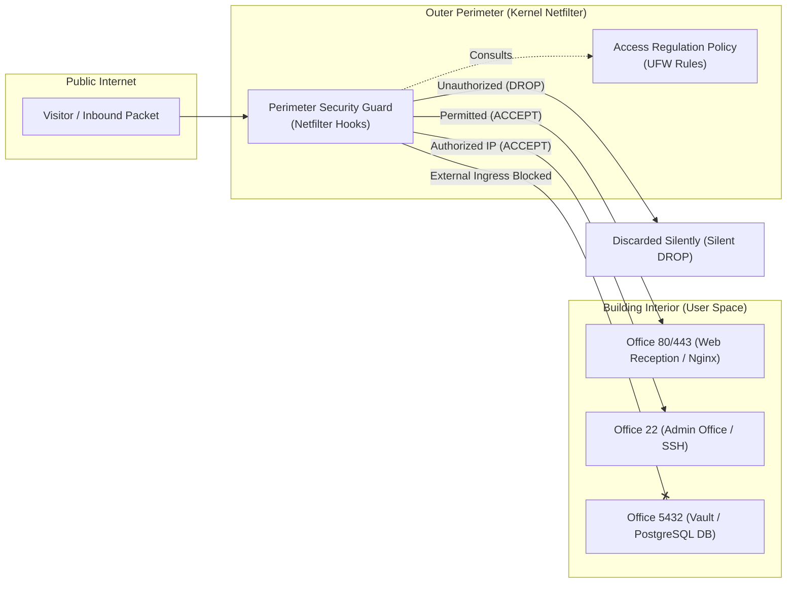
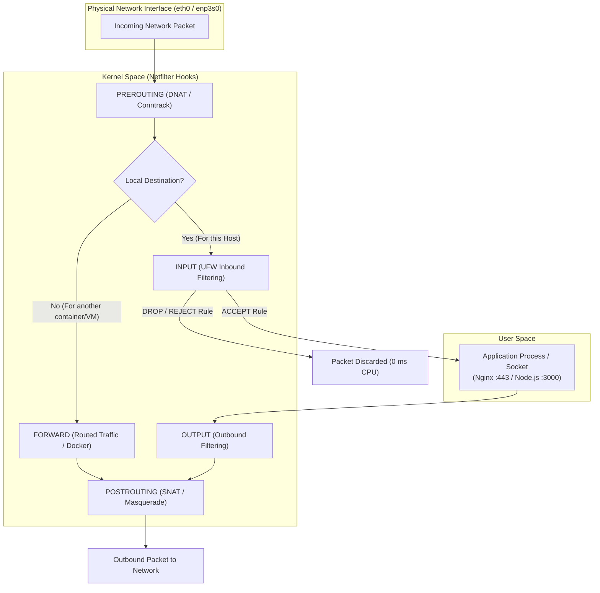
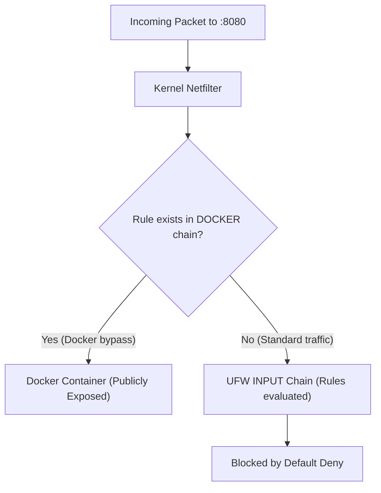

# Linux Firewalls: From Netfilter and UFW to Server Perimeter Security

> [!IMPORTANT]
> **Executive Summary:**
> A Linux firewall is not traditional user-space antivirus software, but a set of packet inspection directives compiled directly into kernel space via **Netfilter**. This architecture allows unauthorized network packets to be discarded with **0 ms CPU latency**, preventing malicious traffic from ever interrupting application processes. Implementing a least-privilege policy (*Default Deny*), dynamic intrusion mitigation with *fail2ban*, disciplined Docker socket isolation, and low-level kernel networking hardening via *sysctl* eliminates more than **99.9%** of perimeter attack surfaces against automated internet scans.

---

## Conceptual Model: Anatomy of the Network Perimeter

To visualize networking security clearly and systematically, the inner workings of a Linux server can be modeled through the following physical perimeter architecture:



* **Ports:** The numbered physical doors of the building (Door 80 for web guests, Door 22 for sysadmins, Door 5432 for internal database vaults).
* **Sockets:** The employees sitting inside each room with their phone receivers off the hook, actively listening for incoming callers.
* **Netfilter (Kernel Space):** The security officer stationed at the perimeter entrance gate. They vet every single person before they can even set foot in the lobby.
* **UFW (*Uncomplicated Firewall*):** The touchscreen control panel used by the administrator to issue plain-English commands to the perimeter guard without writing complex low-level assembly directives.
* **DROP vs REJECT:** When the guard applies `DROP`, they silently discard the intruder without revealing whether anyone is inside. When they apply `REJECT`, they reply with "entry denied", verifying that the building and service exist.

---

## Essential Networking & Security Glossary

| Term | Clear Technical Definition |
|---|---|
| **Socket** | A bidirectional communication endpoint between two programs across a network, defined by a 5-tuple: `(Source IP, Source Port, Destination IP, Destination Port, Protocol)`. |
| **Bind Address** | The specific local network interface IP that an application binds to when listening for traffic (e.g., `127.0.0.1` binds exclusively to internal loopback, while `0.0.0.0` listens on all network interfaces). |
| **Stateful Packet Inspection (SPI)** | The firewall's capability to track established connections, automatically granting ingress to legitimate return traffic without opening arbitrary inbound ports. |
| **Conntrack** | The Linux kernel's internal *Connection Tracking* subsystem responsible for maintaining the in-memory state table of all active network sessions. |
| **SYN Flood** | A Denial of Service (DoS) attack where malicious actors flood a host with spoofed TCP connection initiations to exhaust kernel connection queues and RAM. |

---

## 1. Fundamentals: How Firewalls Operate in the Linux Kernel

Packet filtering in Linux executes directly at the kernel layer through **Netfilter**, a modular framework that intercepts network traffic across five distinct hook points within the operating system's TCP/IP stack:



### The Abstraction Hierarchy in Linux

1. **Netfilter (Kernel Space):** Real-time kernel engine executing packet verdicts (`ACCEPT`, `DROP`, `REJECT`) at microsecond latency.
2. **iptables / nftables (User Space CLI):** Low-level command-line utilities used to declare tables (`filter`, `nat`, `mangle`) and custom packet chains.
3. **UFW (Uncomplicated Firewall):** High-level management frontend created by Canonical to streamline iptables and nftables rule manipulation without complex table syntax.

> [!NOTE]
> When an unauthorized packet is intercepted and dropped using the `DROP` target in the `INPUT` chain, the kernel discards the packet structure instantly in memory. User-space applications (Node.js, PostgreSQL, Nginx) never receive a hardware interrupt, saving critical CPU cycles and system memory.

---

## 2. Initial Diagnosis: Inspecting Sockets and Open Ports

Before declaring any firewall rule, administrators must systematically inspect which processes and network sockets are actively listening on the host.

### Quick Socket Inspection with `ss`

```bash
# Terminal / Output
sudo ss -tlnp
```

The `-tlnp` flags break down as follows:
* `-t`: TCP protocol.
* `-l`: Sockets in the listening state (*LISTEN*).
* `-n`: Display numeric port numbers instead of resolving service names.
* `-p`: Display process identifier (PID) and executable name.

```text
State    Recv-Q   Send-Q     Local Address:Port      Peer Address:Port   Process
LISTEN   0        511              0.0.0.0:80             0.0.0.0:*       users:(("nginx",pid=1240,fd=6))
LISTEN   0        128              0.0.0.0:22             0.0.0.0:*       users:(("sshd",pid=890,fd=3))
LISTEN   0        511            127.0.0.1:3000           0.0.0.0:*       users:(("node",pid=3412,fd=19))
LISTEN   0        128            127.0.0.1:5432           0.0.0.0:*       users:(("postgres",pid=1520,fd=7))
```

### Socket Bind Address Anatomy

| Local Address | Definition | Risk Without Firewall |
|---|---|---|
| `0.0.0.0` / `[::]` | The process listens on **all available network interfaces** (public, private, and loopback). | **Critical:** Any external internet client can reach the socket if unblocked by the kernel firewall. |
| `127.0.0.1` / `[::1]` | The process is bound strictly to the **internal loopback interface**. | **Low:** Only local processes running on the same operating system can communicate with the socket. |
| `192.168.1.50` | The process is bound exclusively to the Local Area Network (LAN) physical interface. | **Medium:** Reachable only by devices within the same local network subnet. |

---

## 3. Remote Lockout Prevention (Safe SSH Configuration)

The most catastrophic operational mistake when provisioning remote servers (cloud VPS on AWS Lightsail, DigitalOcean, or remote dedicated hardware) is enabling UFW before declaring an explicit rule permitting SSH traffic.

> [!CAUTION]
> **Strict Operational Sequence:**
> Never execute `sudo ufw enable` without first running `sudo ufw allow ssh` (or your custom SSH port). If UFW is enabled with the default `deny incoming` policy, your active SSH session will terminate immediately and administrative access will be lost permanently.

### Emergency Recovery Timer (Recommended for Production Upgrades)

When configuring mission-critical remote servers, schedule an automated background deactivation timer before turning on the firewall:

```bash
# Automatically disables UFW after 5 minutes unless manually cancelled
sudo bash -c "sleep 300 && ufw disable" &
```

If your subsequent SSH connection test in a separate terminal window succeeds, kill the background safety timer:

```bash
sudo pkill -f "sleep 300"
```

---

## 4. Base Configuration: Least Privilege & Dual-Stack IPv6 Support

A hardened perimeter operates under an explicit allowlist philosophy: deny all incoming traffic by default and open only verified ports.

### Step 1: Guarantee Dual-Stack IPv6 Protection

Many administrators configure UFW believing their host is fully secured, unaware that IPv6 support is disabled by default in some installations, leaving services completely exposed over public IPv6 routes.

Verify your configuration in `/etc/default/ufw`:

```bash
# 📄 /etc/default/ufw
# Ensure IPv6 support is enabled
IPV6=yes
```

### Step 2: Declare Default Policies

```bash
# 1. Install UFW on Debian / Ubuntu
sudo apt update && sudo apt install -y ufw

# 2. Default incoming policy: Drop all incoming traffic
sudo ufw default deny incoming

# 3. Default outgoing policy: Allow outbound traffic (package managers, DNS, updates)
sudo ufw default allow outgoing

# 4. Default routed policy: Drop routed traffic between network interfaces
sudo ufw default deny routed

# 5. MANDATORY PRE-REQUISITE: Allow SSH access (TCP port 22)
sudo ufw allow 22/tcp comment 'SSH administrative access'

# 6. Enable the firewall
sudo ufw enable
```

```text
# Terminal / Output
Command may disrupt existing ssh connections. Proceed with operation (y|n)? y
Firewall is active and enabled on system startup
```

---

## 5. Managing Application Profiles with UFW (`ufw app`)

Rather than memorizing arbitrary port numbers, UFW supports high-level declarative profiles stored in `/etc/ufw/applications.d/`:

```bash
# List all application profiles currently installed
sudo ufw app list

# Inspect ports and descriptions for a specific profile
sudo ufw app info 'Nginx Full'
```

### Creating a Custom Application Profile for In-House Services

You can define custom profiles for internal microservices or NestJS backends:

```ini
# 📄 /etc/ufw/applications.d/jorgedoicela-backend
[JorgeDoicelaBackend]
title=Jorge Doicela Backend API Monolith
description=Node.js NestJS API service on internal port 3000
ports=3000/tcp
```

```bash
# Refresh UFW application profiles
sudo ufw app update JorgeDoicelaBackend

# Allow the application profile cleanly
sudo ufw allow 'JorgeDoicelaBackend'
```

---

## 6. Granular Rule Declaration Across Environments

### 6.1 Public Web Servers (Cloud Production)

```bash
# Allow standard HTTP traffic (port 80) for Let's Encrypt renewal
sudo ufw allow 80/tcp comment 'HTTP Nginx'

# Allow encrypted HTTPS traffic (port 443)
sudo ufw allow 443/tcp comment 'HTTPS Nginx with TLS'
```

### 6.2 Opening Port Ranges

When deploying WebRTC media gateways or dynamic proxy ports:

```bash
# Allow a UDP port range for media streaming
sudo ufw allow 10000:10100/udp comment 'WebRTC Media Streaming Range'
```

### 6.3 Local Hardware & On-Premises Servers (Home Labs / Office Networks)

Restrict administrative access strictly to your local private subnet or designated static workstation:

```bash
# Allow SSH access strictly from devices on the 192.168.1.0/24 subnet
sudo ufw allow from 192.168.1.0/24 to any port 22 proto tcp comment 'SSH local LAN'

# Allow administrative access from a designated static workstation IP
sudo ufw allow from 192.168.1.15 to any port 22 proto tcp comment 'SSH Admin Laptop'
```

### 6.4 Built-in UFW Rate Limiting

Mitigate automated SSH dictionary and brute-force attacks natively:

```bash
# Blocks IP addresses attempting 6 or more connections within a 30-second window
sudo ufw limit 22/tcp comment 'SSH connection rate limiting'
```

---

## 7. Architectural Resolution: Resolving the Docker and UFW Rule Conflict

> [!WARNING]
> **Docker's Invasive `iptables` Behavior:**
> By default, the Docker daemon (`dockerd`) directly modifies `iptables` chains in the `nat` table and the `FORWARD` filter chain. If you start a container with `-p 8080:8080`, Docker inserts a routing rule in Netfilter that **completely bypasses UFW inbound rules**, exposing the container to the public internet even when UFW is set to `default deny incoming`.



### The 2 Professional Mitigation Strategies:

#### Strategy 1 (Recommended & Secure): Always Bind to Loopback (`127.0.0.1`)
In your `docker-compose.yml` configurations, never expose ports on `0.0.0.0`. Always bind services to local loopback and let Nginx act as the sole reverse proxy:

```yaml
# docker-compose.yml
services:
  database:
    image: postgres:16-alpine
    ports:
      # SECURE: Accessible strictly within the local host by local processes
      - "127.0.0.1:5432:5432"
      # INSECURE (AVOID): Would expose the database to the entire public internet
      # - "5432:5432"
```

#### Strategy 2 (For Complex Multi-Container Networks): Utilize the `DOCKER-USER` Chain
Netfilter reserves the `DOCKER-USER` chain specifically so user-defined filtering rules execute **before** Docker forwards traffic. You can leverage the community-audited utility `ufw-docker` to manage container ingress seamlessly without breaking outbound container masquerading.

---

## 8. Advanced Hardening: fail2ban and Kernel Network Parameters (`sysctl`)

Static firewall rules are reinforced through dynamic intrusion detection and low-level kernel parameter tuning.

### 8.1 Dynamic Jail Protection with fail2ban

`fail2ban` continuously audits authentication logs from `sshd` and dynamically communicates with Netfilter to temporarily ban repeating attackers:

```ini
# 📄 /etc/fail2ban/jail.local
[DEFAULT]
bantime  = 3600
findtime = 600
maxretry = 5

[sshd]
enabled  = true
port     = 22
logpath  = %(sshd_log)s
backend  = systemd
```

```bash
# Start and enable fail2ban as a systemd service
sudo systemctl enable --now fail2ban

# Verify jail status and currently banned IP addresses
sudo fail2ban-client status sshd
```

### 8.2 Low-Level Kernel Network Hardening (`sysctl`)

Create a custom configuration file to harden the TCP/IP stack against SYN flood attacks, packet spoofing, and routing manipulation:

```ini
# 📄 /etc/sysctl.d/99-hardening.conf
# Enable SYN flood attack protection (SYN Cookies)
net.ipv4.tcp_syncookies = 1

# Disable ICMP redirect acceptance (mitigates Man-in-the-Middle attacks)
net.ipv4.conf.all.accept_redirects = 0
net.ipv6.conf.all.accept_redirects = 0
net.ipv4.conf.all.send_redirects = 0

# Disable Source Routing packet acceptance
net.ipv4.conf.all.accept_source_route = 0
net.ipv6.conf.all.accept_source_route = 0

# Ignore ICMP broadcast echo requests (mitigates Smurf amplification attacks)
net.ipv4.icmp_echo_ignore_broadcasts = 1

# Enable Reverse Path Filtering (anti-IP spoofing)
net.ipv4.conf.all.rp_filter = 1
net.ipv4.conf.default.rp_filter = 1

# Increase connection tracking table capacity (Conntrack) for high concurrency
net.netfilter.nf_conntrack_max = 65536

# Enable full Address Space Layout Randomization (ASLR against memory exploits)
kernel.randomize_va_space = 2
```

```bash
# Apply new kernel parameters immediately without rebooting
sudo sysctl -p /etc/sysctl.d/99-hardening.conf
```

---

## 9. External Audit with Nmap: Verifying Port States

To verify your firewall's effectiveness from an external standpoint, run a stealth TCP SYN scan from a remote machine:

```bash
# Forensic port scan with Nmap
nmap -sS -Pn -p 22,80,443,3000,5432 <SERVER_IP>
```

### Interpreting Nmap Scan Results:

| Nmap Reported State | Technical Meaning | Security Level |
|---|---|---|
| `filtered` | The firewall dropped the packet silently (`DROP`). The attacker cannot discern if the port is closed or if the host exists. | **Optimal (Standard UFW Behavior)** |
| `closed` | The kernel replied with a `TCP RST` flag. No application is listening, but host existence is confirmed. | **Acceptable but leaks host presence** |
| `open` | A user-space socket completed the handshake with `SYN-ACK`. The port is actively accepting connections. | **Legitimate public services only** |

---

## 10. Monitoring and Packet Logging Without Disk Saturation

UFW logs blocked traffic events to `/var/log/ufw.log` or through systemd's journal:

```bash
# Set log rate to low to preserve I/O on 1 GB RAM VPS servers
sudo ufw logging low

# Stream real-time blocked connection attempts
sudo journalctl -k -f | grep '[UFW BLOCK]'
```

### Anatomy of a Firewall Block Log Entry:
```text
[UFW BLOCK] IN=eth0 OUT= MAC=52:54:00:12:34:56 SRC=198.51.100.24 DST=203.0.113.10 LEN=40 TOS=0x00 PREC=0x00 TTL=245 ID=54321 PROTO=TCP SPT=49152 DPT=3306 WINDOW=1024 RES=0x00 SYN URGP=0
```
* `SRC`: Attacker's IP address.
* `DPT=3306`: Targeted port attempting intrusion (e.g., MySQL database).
* `SYN`: TCP connection initialization flag that was discarded in 0 ms.

---

## 11. Daily Operational Command Reference

| Command | Operational Purpose |
|---|---|
| `sudo ufw status verbose` | Displays firewall status, default policies, active rules, and bound network interfaces. |
| `sudo ufw status numbered` | Lists all active rules preceded by an index number `[ 1]`, `[ 2]` for targeted deletion. |
| `sudo ufw delete <index>` | Precisely removes a specific rule by its numbered index without ambiguity. |
| `sudo ufw insert 1 allow ...` | Inserts a rule at the top priority index before all subsequent rules. |
| `sudo ufw reload` | Reloads active firewall tables on the fly without dropping established sessions. |
| `sudo ufw reset` | Resets UFW back to factory default settings and disables the service. |

---

## Conclusion and Verification Checklist

A professionally hardened server adheres to the **Defense-in-Depth** model:

- [x] **Principle of Least Privilege:** `default deny incoming` enforced in UFW.
- [x] **Dual-Stack Protection:** `IPV6=yes` verified in `/etc/default/ufw`.
- [x] **Secure Administrative Ingress:** SSH allowed strictly on designated ports with rate limiting and emergency deactivation timer.
- [x] **Socket Isolation:** Internal application processes and database instances bound exclusively to `127.0.0.1`.
- [x] **Docker Controlled:** No container exposed on `0.0.0.0` bypassing perimeter rules.
- [x] **Dynamic Protection:** `fail2ban` actively auditing and banning authentication brute-force vectors.
- [x] **Kernel Hardening:** Low-level TCP/IP protection parameters deployed in `/etc/sysctl.d/99-hardening.conf`.
- [x] **External Audit Validation:** Nmap confirms `filtered` state on all non-public ports.
