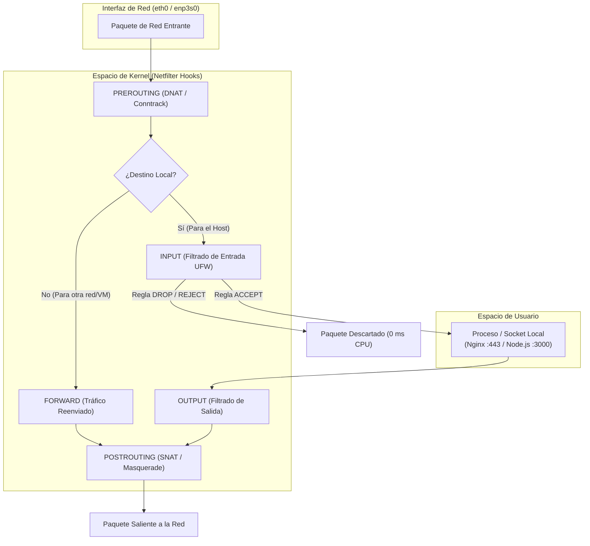

# Firewall en Linux: De Netfilter y UFW a la Seguridad Perimetral de Servidores

## Resumen Arquitectónico
Un firewall en Linux no es una aplicación aislada de espacio de usuario, sino un conjunto de directivas ejecutadas directamente por el subsistema **Netfilter** en el espacio de kernel. Esta guía técnica detalla la progresión completa para configurar, gobernar y auditar la seguridad perimetral de un servidor Linux (Debian/Ubuntu), partiendo desde los fundamentos de enrutamiento de paquetes TCP/IP y el diagnóstico de sockets locales, pasando por la gestión de reglas con **UFW** (*Uncomplicated Firewall*), hasta técnicas avanzadas de mitigación de fuerza bruta con **fail2ban**, convivencia con sockets de **Docker** y endurecimiento del kernel mediante **sysctl**.

---

## 1. Fundamentos: ¿Cómo opera un Firewall en el Kernel de Linux?

El filtrado de tráfico en Linux opera a nivel del kernel mediante **Netfilter**, un framework modular que intercepta paquetes de red en cinco puntos clave de la pila de red del sistema operativo:



### La Cadena de Abstracciones en Linux

1. **Netfilter (Kernel Space):** Subsistema en tiempo real que ejecuta las decisiones de filtrado (`ACCEPT`, `DROP`, `REJECT`).
2. **iptables / nftables (User Space CLI):** Herramientas de bajo nivel para manipular tablas (`filter`, `nat`, `mangle`) y cadenas del kernel.
3. **UFW (Uncomplicated Firewall):** Capa de abstracción diseñada por Canonical para simplificar la gestión de iptables/nftables sin requerir sintaxis compleja de tablas de bajo nivel.

> [!NOTE]
> Cuando un paquete no deseado es interceptado y descartado con la directiva `DROP` en la cadena `INPUT`, el kernel lo elimina inmediatamente en memoria. La aplicación en espacio de usuario (Node.js, PostgreSQL, Nginx) nunca llega a recibir la interrupción de red, ahorrando ciclos de CPU y memoria RAM.

---

## 2. Diagnóstico Inicial: Inspección de Sockets y Puertos Abiertos

Antes de aplicar cualquier regla de firewall, es indispensable diagnosticar exactamente qué procesos y sockets están escuchando en el sistema operativo.

### Comando de Inspección con `ss`

```bash
# Terminal / Salida
sudo ss -tlnp
```

La opción `-tlnp` desglosa:
* `-t`: Protocolo TCP.
* `-l`: Sockets en estado de escucha (*LISTEN*).
* `-n`: Muestra números de puerto en lugar de nombres de servicio.
* `-p`: Identificador de proceso (PID) y nombre del programa.

```text
State    Recv-Q   Send-Q     Local Address:Port      Peer Address:Port   Process
LISTEN   0        511              0.0.0.0:80             0.0.0.0:*       users:(("nginx",pid=1240,fd=6))
LISTEN   0        128              0.0.0.0:22             0.0.0.0:*       users:(("sshd",pid=890,fd=3))
LISTEN   0        511            127.0.0.1:3000           0.0.0.0:*       users:(("node",pid=3412,fd=19))
LISTEN   0        128            127.0.0.1:5432           0.0.0.0:*       users:(("postgres",pid=1520,fd=7))
```

### Anatomía de las Direcciones de Enlace (*Bind Addresses*)

| Dirección Local | Significado | Riesgo sin Firewall |
|---|---|---|
| `0.0.0.0` / `[::]` | El servicio escucha en **todas las interfaces de red** (pública, privada y loopback). | **Crítico:** Cualquier host de internet puede alcanzar el puerto si el firewall del kernel no lo bloquea. |
| `127.0.0.1` / `[::1]` | El servicio escucha estrictamente en **loopback interno**. | **Bajo:** Solo procesos locales dentro del mismo servidor pueden comunicarse con el socket. |
| `192.168.1.50` | El servicio escucha exclusivamente en la interfaz de la red de área local (LAN). | **Medio:** Accesible solo por dispositivos conectados al mismo segmento de red local. |

---

## 3. Procedimiento Anti-Bloqueo Remoto (Prevención de SSH Lockout)

El error más grave al configurar un firewall en un servidor remoto (VPS en la nube o máquina dedicada) es activar el servicio antes de haber declarado la regla que autoriza el tráfico SSH.

> [!CRITICAL]
> **Orden de Operaciones Inviolable:**  
> Jamás ejecutes `sudo ufw enable` sin haber ejecutado previamente `sudo ufw allow ssh` (o el puerto SSH personalizado). Si se activa con la política por defecto `deny incoming`, tu sesión SSH actual se cerrará y perderás el acceso administrativo al servidor de forma permanente.

### Salvaguarda de Emergencia con Temporizador (Opcional para Pruebas Remotas)

Si estás configurando un servidor remoto crítico y deseas una red de seguridad contra desconexiones accidentales, programa una tarea de auto-desactivación temporal en segundo plano antes de encender el firewall:

```bash
# Desactiva UFW automáticamente después de 5 minutos si no cancelas el proceso
sudo bash -c "sleep 300 && ufw disable" &
```

Si tus pruebas de conexión SSH en una terminal paralela son exitosas, cancelas el temporizador matando el proceso `sleep` con `kill`.

---

## 4. Configuración Base: Política de Mínimo Privilegio (*Default Deny*)

Un cortafuegos robusto debe operar bajo la filosofía de lista blanca: bloquear todo por defecto y abrir únicamente lo estrictamente necesario.

```bash
# 1. Instalar UFW en Debian / Ubuntu
sudo apt update && sudo apt install -y ufw

# 2. Política por defecto: Rechazar todo el tráfico entrante
sudo ufw default deny incoming

# 3. Política por defecto: Permitir el tráfico saliente (descargas, paquetes, repositorios)
sudo ufw default allow outgoing

# 4. Política por defecto: Denegar el reenvío de tráfico entre interfaces
sudo ufw default deny routed

# 5. REGLA OBLIGATORIA PREVIA: Permitir SSH (Puerto 22 TCP)
sudo ufw allow 22/tcp comment 'Acceso administrativo SSH'

# 6. Activar el Firewall
sudo ufw enable
```

```text
# Terminal / Salida
Command may disrupt existing ssh connections. Proceed with operation (y|n)? y
Firewall is active and enabled on system startup
```

---

## 5. Declaración de Reglas Granulares por Entorno

### 5.1 Servidores Web Públicos (Producción en la Nube)

En un servidor web que expone servicios HTTP/HTTPS públicos:

```bash
# Permitir tráfico HTTP estándar (puerto 80) para redirección SSL
sudo ufw allow 80/tcp comment 'HTTP Nginx'

# Permitir tráfico HTTPS cifrado (puerto 443)
sudo ufw allow 443/tcp comment 'HTTPS Nginx con TLS'
```

### 5.2 Servidores Propios en Red Local (Entornos On-Premises / Home Server)

Si administras un servidor físico en tu hogar o laboratorio local y deseas que el puerto SSH no sea accesible desde el exterior, restringe el acceso únicamente a tu subred privada:

```bash
# Permitir SSH solo desde equipos dentro de la subred 192.168.1.0/24
sudo ufw allow from 192.168.1.0/24 to any port 22 proto tcp comment 'SSH LAN local'

# Permitir acceso administrativo desde una IP estática específica
sudo ufw allow from 192.168.1.15 to any port 22 proto tcp comment 'SSH Laptop Administrador'
```

### 5.3 Limitación de Tasa Nativa de UFW (*Rate Limiting*)

UFW incluye una directiva integrada para mitigar ataques de fuerza bruta en el protocolo SSH:

```bash
# Bloquea temporalmente IPs que intenten 6 o más conexiones en una ventana de 30 segundos
sudo ufw limit 22/tcp comment 'Rate limit SSH anti-bruteforce'
```

---

## 6. Convivencia con Docker y Aislamiento de Servicios Locales

> [!WARNING]
> **El Comportamiento de Docker sobre `iptables`:**  
> Por diseño, el daemon de Docker (`dockerd`) manipula directamente las cadenas de `iptables` en la tabla `nat` y en la cadena `DOCKER-USER`. Si levantas un contenedor con el mapeo `-p 8080:8080`, Docker inserta una regla de reenvío en Netfilter que **bypassea las reglas de UFW**.

### Buenas Prácticas para Contenedores y Bases de Datos:

1. **Enlazar siempre a Loopback en Docker Compose / CLI:**
   ```yaml
   # docker-compose.yml
   ports:
     - "127.0.0.1:5432:5432"  # Seguro: solo accesible desde el host local
     # En lugar de "5432:5432" que expondría la base de datos a internet público
   ```
2. **Uso de Redes Internas Desconectadas:** Para servicios que no requieren salir a internet (como contenedores efímeros o sandboxes de ejecución de código), utiliza el modo `--network=none`.

---

## 7. Hardening Avanzado: fail2ban y Ajustes de Red en el Kernel (`sysctl`)

El firewall estático se complementa con herramientas de monitoreo dinámico y endurecimiento de parámetros de red a nivel de kernel.

### 7.1 Integración con fail2ban

`fail2ban` inspecciona los logs de autenticación de `sshd` e interactúa automáticamente con Netfilter para aplicar bloqueos dinámicos temporales a atacantes recurrentes.

```ini
# 📄 /etc/fail2ban/jail.local
[DEFAULT]
bantime  = 3600
findtime = 600
maxretry = 5

[sshd]
enabled  = true
port     = 22
logpath  = %(sshd_log)s
backend  = systemd
```

```bash
# Iniciar y habilitar el servicio
sudo systemctl enable --now fail2ban

# Consultar el estado de la cárcel SSH y las IPs bloqueadas
sudo fail2ban-client status sshd
```

### 7.2 Endurecimiento de Parámetros de Red en el Kernel (`sysctl`)

Crea un archivo de configuración dedicado para blindar el stack de red contra ataques de inundación y spoofing:

```ini
# 📄 /etc/sysctl.d/99-hardening.conf
# Protección contra ataques de inundación TCP SYN (SYN Flood)
net.ipv4.tcp_syncookies = 1

# Ignorar paquetes de redirección ICMP (vector de ataques Man-in-the-Middle)
net.ipv4.conf.all.accept_redirects = 0
net.ipv6.conf.all.accept_redirects = 0
net.ipv4.conf.all.send_redirects = 0

# Descartar paquetes con enrutamiento de origen estricto (Source Routing)
net.ipv4.conf.all.accept_source_route = 0
net.ipv6.conf.all.accept_source_route = 0

# Ignorar peticiones de broadcast ICMP (mitigación de ataques Smurf)
net.ipv4.icmp_echo_ignore_broadcasts = 1

# Filtrado de Ruta Inversa (Reverse Path Filtering / Anti-IP Spoofing)
net.ipv4.conf.all.rp_filter = 1
net.ipv4.conf.default.rp_filter = 1

# Espacio de direcciones aleatorio máximo (ASLR)
kernel.randomize_va_space = 2
```

```bash
# Aplicar los parámetros de inmediato sin reiniciar el servidor
sudo sysctl -p /etc/sysctl.d/99-hardening.conf
```

---

## 8. Guía de Operación y Auditoría Diaria

| Comando | Propósito y Salida |
|---|---|
| `sudo ufw status verbose` | Muestra el estado del firewall, políticas por defecto y reglas activas con perfiles de interfaz. |
| `sudo ufw status numbered` | Despliega las reglas indexadas con un número secuencial `[ 1]`, `[ 2]` para operaciones de borrado. |
| `sudo ufw delete <número>` | Elimina de forma precisa la regla correspondiente al índice numérico sin ambigüedad. |
| `sudo ufw reload` | Recarga las tablas del firewall en caliente sin interrumpir sesiones establecidas. |
| `sudo ufw reset` | Restaura UFW a su configuración de fábrica y desactiva el servicio. |
| `sudo journalctl -u ufw` | Inspecciona los registros de eventos de bloqueo del firewall gestionados por systemd. |

---

## Conclusión y Checklist de Validación

Un servidor protegido de forma profesional implementa el modelo de **Defensa en Profundidad**:

- [x] **Política de Mínimo Privilegio:** `default deny incoming` activo en UFW.
- [x] **Acceso Administrativo Seguro:** SSH permitido únicamente en puertos específicos, con rate limiting o restringido por IP/subred.
- [x] **Aislamiento de Sockets:** Aplicaciones internas y bases de datos enlazadas estrictamente a `127.0.0.1`.
- [x] **Defensa Dinámica:** `fail2ban` monitoreando intentos fallidos de autenticación.
- [x] **Protección de Kernel:** Parámetros de red de bajo nivel aplicados en `/etc/sysctl.d/99-hardening.conf`.
