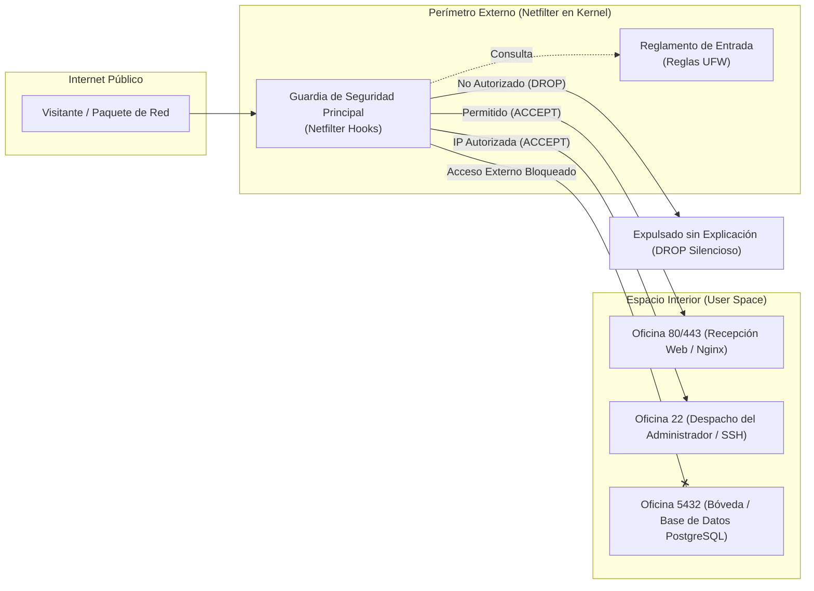
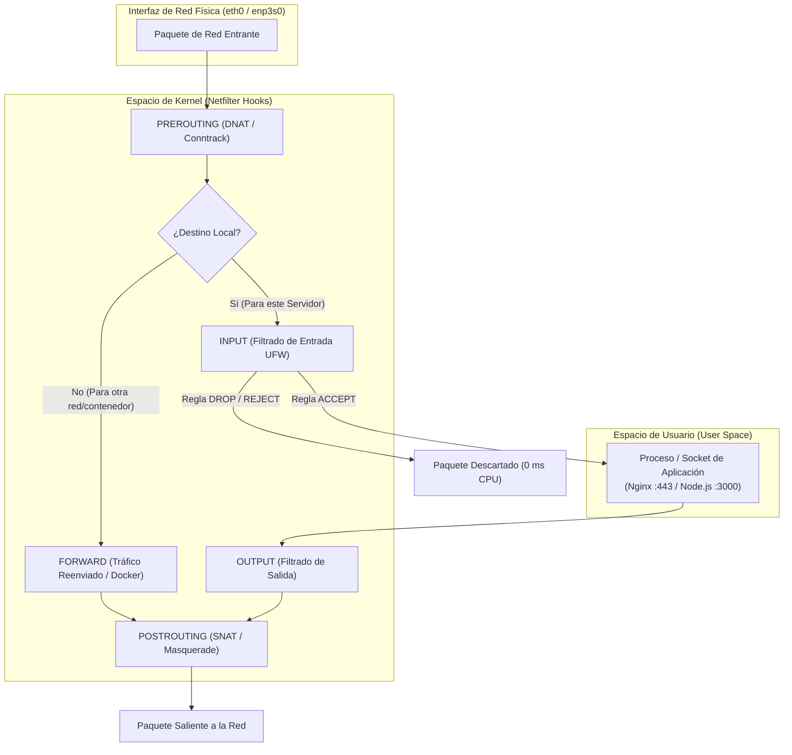
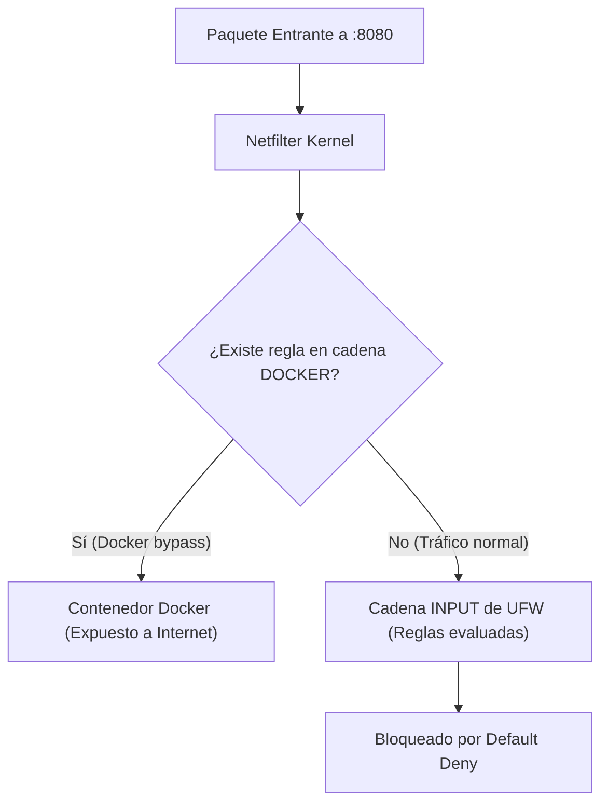

# Firewall en Linux: De Netfilter y UFW a la Seguridad Perimetral de Servidores

> [!IMPORTANT]
> **Resumen Ejecutivo:**
> Un firewall en Linux no es un software antivirus tradicional de espacio de usuario, sino un conjunto de directivas inyectadas directamente en el espacio de kernel a través de **Netfilter**. Esta arquitectura permite descartar paquetes maliciosos a una velocidad de **0 ms de CPU**, impidiendo que el tráfico ilegítimo despierte a los procesos de las aplicaciones. La implementación de una política de mínimo privilegio (*Default Deny*), mitigación dinámica con *fail2ban*, aislamiento de contenedores Docker y endurecimiento del kernel con *sysctl* reduce la superficie de ataque perimetral en más de un **99.9%** ante escaneos automatizados en internet.

---

## Modelo Conceptual: Anatomía del Perímetro de Red

Para comprender la seguridad de redes de forma clara y visual, el funcionamiento de un servidor Linux equivale a la siguiente arquitectura física perimetral:



* **Los Puertos (Ports):** Son las puertas numeradas del edificio (Puerta 80 para visitantes web, Puerta 22 para el administrador, Puerta 5432 para la base de datos).
* **Los Sockets:** Son los empleados sentados dentro de cada oficina con el teléfono descolgado, esperando a que alguien toque a la puerta para atenderlo.
* **Netfilter (Kernel Space):** Es el guardia de seguridad apostado en la reja perimetral exterior. Inspecciona a cada visitante antes de que si quiera ponga un pie en el vestíbulo.
* **UFW (*Uncomplicated Firewall*):** Es el panel de control táctil y amigable que utiliza el administrador para darle órdenes sencillas al guardia sin tener que escribir instrucciones complejas en lenguaje militar.
* **DROP vs REJECT:** Si el guardia aplica `DROP`, simplemente ignora al intruso y lo deja esperando en silencio sin confirmar si hay alguien dentro. Si aplica `REJECT`, le dice formalmente "no puedes pasar", revelando que la oficina existe.

---

## Glosario Esencial de Redes y Seguridad

| Término | Definición Técnica Sencilla |
|---|---|
| **Socket** | Punto final de comunicación bidireccional entre dos programas en la red, compuesto por una tupla `(IP de Origen, Puerto de Origen, IP de Destino, Puerto de Destino, Protocolo)`. |
| **Bind Address** | La dirección IP local específica a la que una aplicación se ata para escuchar conexiones (ej. `127.0.0.1` solo escucha al propio servidor, `0.0.0.0` escucha al mundo entero). |
| **Stateful Packet Inspection (SPI)** | Capacidad del firewall de recordar el estado de las conexiones existentes para permitir automáticamente las respuestas legítimas sin tener que abrir puertos adicionales. |
| **Conntrack** | Módulo del kernel de Linux (*Connection Tracking*) encargado de registrar la tabla en memoria con todas las conexiones de red activas en el sistema. |
| **SYN Flood** | Ataque de denegación de servicio (DoS) donde un atacante envía miles de peticiones de conexión incompletas para saturar la memoria del servidor. |

---

## 1. Fundamentos: ¿Cómo opera un Firewall en el Kernel de Linux?

El filtrado de tráfico en Linux opera a nivel del kernel mediante **Netfilter**, un framework modular que intercepta paquetes de red en cinco puntos clave de la pila TCP/IP del sistema operativo:



### La Cadena de Abstracciones en Linux

1. **Netfilter (Kernel Space):** Subsistema en tiempo real que ejecuta las decisiones de filtrado (`ACCEPT`, `DROP`, `REJECT`) a nivel de microsegundos.
2. **iptables / nftables (User Space CLI):** Herramientas de bajo nivel para manipular tablas (`filter`, `nat`, `mangle`) y cadenas del kernel.
3. **UFW (Uncomplicated Firewall):** Capa de abstracción diseñada por Canonical para simplificar la gestión de iptables/nftables sin requerir sintaxis compleja de tablas de bajo nivel.

> [!NOTE]
> Cuando un paquete no deseado es interceptado y descartado con la directiva `DROP` en la cadena `INPUT`, el kernel lo elimina inmediatamente en memoria. La aplicación en espacio de usuario (Node.js, PostgreSQL, Nginx) nunca llega a recibir la interrupción de hardware, ahorrando ciclos de CPU y memoria RAM.

---

## 2. Diagnóstico Inicial: Inspección de Sockets y Puertos Abiertos

Antes de aplicar cualquier regla de firewall, es indispensable diagnosticar exactamente qué procesos y sockets están escuchando en el sistema operativo.

### Inspección Rápida de Sockets con `ss`

```bash
# Terminal / Salida
sudo ss -tlnp
```

La opción `-tlnp` desglosa:
* `-t`: Protocolo TCP.
* `-l`: Sockets en estado de escucha (*LISTEN*).
* `-n`: Muestra números de puerto en lugar de nombres de servicio.
* `-p`: Identificador de proceso (PID) y nombre del programa.

```text
State    Recv-Q   Send-Q     Local Address:Port      Peer Address:Port   Process
LISTEN   0        511              0.0.0.0:80             0.0.0.0:*       users:(("nginx",pid=1240,fd=6))
LISTEN   0        128              0.0.0.0:22             0.0.0.0:*       users:(("sshd",pid=890,fd=3))
LISTEN   0        511            127.0.0.1:3000           0.0.0.0:*       users:(("node",pid=3412,fd=19))
LISTEN   0        128            127.0.0.1:5432           0.0.0.0:*       users:(("postgres",pid=1520,fd=7))
```

### Anatomía de las Direcciones de Enlace (*Bind Addresses*)

| Dirección Local | Significado | Riesgo sin Firewall |
|---|---|---|
| `0.0.0.0` / `[::]` | El servicio escucha en **todas las interfaces de red** (pública, privada y loopback). | **Crítico:** Cualquier host de internet puede alcanzar el puerto si el firewall del kernel no lo bloquea. |
| `127.0.0.1` / `[::1]` | El servicio escucha estrictamente en **loopback interno**. | **Bajo:** Solo procesos locales dentro del mismo servidor pueden comunicarse con el socket. |
| `192.168.1.50` | El servicio escucha exclusivamente en la interfaz de la red de área local (LAN). | **Medio:** Accesible solo por dispositivos conectados al mismo segmento de red local. |

---

## 3. Procedimiento Anti-Bloqueo Remoto (Prevención de SSH Lockout)

El error más costoso al configurar un firewall en un servidor remoto (VPS en AWS Lightsail, DigitalOcean o servidor dedicado) es activar el servicio antes de haber declarado la regla que autoriza el tráfico SSH.

> [!CAUTION]
> **Orden de Operaciones Inviolable:**
> Jamás ejecutes `sudo ufw enable` sin haber ejecutado previamente `sudo ufw allow ssh` (o tu puerto SSH personalizado). Si se activa con la política por defecto `deny incoming`, tu sesión SSH actual se cerrará de inmediato y perderás el acceso administrativo al servidor.

### Salvaguarda de Emergencia con Temporizador (Recomendada para Producción)

Si estás configurando un servidor remoto crítico y deseas una red de seguridad contra desconexiones accidentales, programa una tarea de auto-desactivación temporal en segundo plano antes de encender el firewall:

```bash
# Desactiva UFW automáticamente después de 5 minutos si no cancelas el proceso
sudo bash -c "sleep 300 && ufw disable" &
```

Si tus pruebas de conexión SSH en una terminal paralela son exitosas, cancelas el temporizador matando el proceso en segundo plano:

```bash
sudo pkill -f "sleep 300"
```

---

## 4. Configuración Base: Mínimo Privilegio y Soporte Dual-Stack IPv6

Un cortafuegos profesional debe operar bajo la filosofía de lista blanca: bloquear todo por defecto y abrir únicamente lo estrictamente necesario.

### Paso 1: Garantizar la Protección Dual-Stack IPv6

Muchos administradores configuran UFW creyendo que sus reglas protegen todo el servidor, sin notar que el soporte IPv6 está desactivado y dejando los servicios expuestos a través de direcciones IPv6 públicas.

Verifica la configuración en `/etc/default/ufw`:

```bash
# 📄 /etc/default/ufw
# Asegurar que el soporte IPv6 esté activado en 'yes'
IPV6=yes
```

### Paso 2: Declarar las Políticas por Defecto

```bash
# 1. Instalar UFW en Debian / Ubuntu
sudo apt update && sudo apt install -y ufw

# 2. Política por defecto: Rechazar todo el tráfico entrante
sudo ufw default deny incoming

# 3. Política por defecto: Permitir el tráfico saliente (descargas, paquetes, repositorios)
sudo ufw default allow outgoing

# 4. Política por defecto: Denegar el reenvío de tráfico entre interfaces
sudo ufw default deny routed

# 5. REGLA OBLIGATORIA PREVIA: Permitir SSH (Puerto 22 TCP)
sudo ufw allow 22/tcp comment 'Acceso administrativo SSH'

# 6. Activar el Firewall
sudo ufw enable
```

```text
# Terminal / Salida
Command may disrupt existing ssh connections. Proceed with operation (y|n)? y
Firewall is active and enabled on system startup
```

---

## 5. Gestión de Perfiles de Aplicación en UFW (`ufw app`)

En lugar de recordar números de puertos individuales, UFW permite utilizar perfiles de aplicaciones declarados en `/etc/ufw/applications.d/`:

```bash
# Listar perfiles disponibles en el sistema
sudo ufw app list

# Inspeccionar los detalles y puertos de un perfil específico
sudo ufw app info 'Nginx Full'
```

### Creación de un Perfil Personalizado para Servicios Propios

Puedes crear un perfil declarativo para tus propios microservicios o aplicaciones NestJS:

```ini
# 📄 /etc/ufw/applications.d/jorgedoicela-backend
[JorgeDoicelaBackend]
title=Jorge Doicela Backend API Monolith
description=Node.js NestJS API service on internal port 3000
ports=3000/tcp
```

```bash
# Actualizar los perfiles en UFW
sudo ufw app update JorgeDoicelaBackend

# Permitir el perfil fácilmente
sudo ufw allow 'JorgeDoicelaBackend'
```

---

## 6. Declaración de Reglas Granulares por Entorno

### 6.1 Servidores Web Públicos (Producción Cloud)

```bash
# Permitir tráfico HTTP estándar (puerto 80) para renovación Let's Encrypt
sudo ufw allow 80/tcp comment 'HTTP Nginx'

# Permitir tráfico HTTPS cifrado (puerto 443)
sudo ufw allow 443/tcp comment 'HTTPS Nginx con TLS'
```

### 6.2 Apertura de Rangos de Puertos

Si despliegas servicios como streaming WebRTC o proxies dinámicos:

```bash
# Permitir un rango de puertos UDP para media streaming
sudo ufw allow 10000:10100/udp comment 'Rango WebRTC Media'
```

### 6.3 Servidores en Red Local (Home Server / Laboratorio On-Premises)

Restringe el acceso administrativo a una subred interna o dirección IP estática:

```bash
# Permitir SSH solo desde equipos dentro de la subred local 192.168.1.0/24
sudo ufw allow from 192.168.1.0/24 to any port 22 proto tcp comment 'SSH LAN local'

# Permitir acceso administrativo desde una IP estática de confianza
sudo ufw allow from 192.168.1.15 to any port 22 proto tcp comment 'SSH Laptop Administrador'
```

### 6.4 Limitación de Tasa Nativa de UFW (*Rate Limiting*)

Mitiga ataques automatizados de fuerza bruta en SSH sin necesidad de herramientas externas:

```bash
# Bloquea temporalmente IPs que intenten 6 o más conexiones en una ventana de 30 segundos
sudo ufw limit 22/tcp comment 'Rate limit SSH anti-bruteforce'
```

---

## 7. Resolución Arquitectónica del Conflicto de Reglas: Docker y UFW

> [!WARNING]
> **El Comportamiento Invasivo de Docker sobre `iptables`:**
> Por defecto, el daemon de Docker (`dockerd`) manipula directamente las cadenas de `iptables` en la tabla `nat` y en la cadena de reenvío `FORWARD`. Si ejecutas un contenedor con `-p 8080:8080`, Docker inserta una regla en Netfilter que **bypassea por completo las reglas de UFW**, exponiendo el puerto al mundo aunque UFW esté en `default deny incoming`.



### Los 2 Enfoques Profesionales de Solución:

#### Enfoque 1 (Recomendado y Seguro): Enlazar siempre a Loopback (`127.0.0.1`)
En tus archivos `docker-compose.yml`, nunca expongas puertos en `0.0.0.0`. Enlaza siempre a localhost y deja que Nginx maneje la exposición pública:

```yaml
# docker-compose.yml
services:
  database:
    image: postgres:16-alpine
    ports:
      # SEGURO: Solo accesible dentro del servidor por procesos locales
      - "127.0.0.1:5432:5432"
      # INSEGURO (EVITAR): Expondría la base de datos a todo internet
      # - "5432:5432"
```

#### Enfoque 2 (Para redes de Contenedores Complejas): Usar la Cadena `DOCKER-USER`
Netfilter reserva la cadena `DOCKER-USER` específicamente para que las reglas del administrador se ejecuten **antes** de que Docker enrute el paquete. Puedes utilizar la utilidad comunitaria auditada `ufw-docker` para gestionar esta cadena de forma nativa sin romper el NAT saliente de los contenedores.

---

## 8. Hardening Avanzado: fail2ban y Ajustes del Kernel (`sysctl`)

El firewall estático se complementa con herramientas de detección reactiva y optimización de memoria de red a nivel de kernel.

### 8.1 Mitigación Dinámica con fail2ban

`fail2ban` audita los logs de autenticación de `sshd` e interactúa automáticamente con Netfilter para expulsar temporalmente a las direcciones IP atacantes:

```ini
# 📄 /etc/fail2ban/jail.local
[DEFAULT]
bantime  = 3600
findtime = 600
maxretry = 5

[sshd]
enabled  = true
port     = 22
logpath  = %(sshd_log)s
backend  = systemd
```

```bash
# Iniciar y habilitar el servicio
sudo systemctl enable --now fail2ban

# Consultar el estado de la cárcel SSH y las IPs bloqueadas
sudo fail2ban-client status sshd
```

### 8.2 Endurecimiento de Parámetros de Red en el Kernel (`sysctl`)

Crea un archivo de configuración dedicado para blindar el stack de red contra ataques de inundación, manipulación de enrutamiento y spoofing:

```ini
# 📄 /etc/sysctl.d/99-hardening.conf
# Protección contra ataques de inundación TCP SYN (SYN Cookies)
net.ipv4.tcp_syncookies = 1

# Desactivar redirecciones ICMP (vector común de ataques Man-in-the-Middle)
net.ipv4.conf.all.accept_redirects = 0
net.ipv6.conf.all.accept_redirects = 0
net.ipv4.conf.all.send_redirects = 0

# Descartar paquetes con enrutamiento de origen estricto (Source Routing)
net.ipv4.conf.all.accept_source_route = 0
net.ipv6.conf.all.accept_source_route = 0

# Ignorar peticiones de broadcast ICMP (mitigación de ataques Smurf Amplification)
net.ipv4.icmp_echo_ignore_broadcasts = 1

# Filtrado de Ruta Inversa (Reverse Path Filtering / Anti-IP Spoofing)
net.ipv4.conf.all.rp_filter = 1
net.ipv4.conf.default.rp_filter = 1

# Capacidad de la tabla de seguimiento de conexiones (Conntrack) para alto tráfico
net.netfilter.nf_conntrack_max = 65536

# Espacio de direcciones aleatorio máximo (ASLR contra exploits de memoria)
kernel.randomize_va_space = 2
```

```bash
# Aplicar los nuevos parámetros de inmediato sin reiniciar el servidor
sudo sysctl -p /etc/sysctl.d/99-hardening.conf
```

---

## 9. Auditoría Externa con Nmap: Validación de Estados

Para verificar desde el exterior la efectividad de tu firewall, ejecuta un escaneo SYN sigiloso desde una máquina remota:

```bash
# Escaneo forense de puertos con Nmap
nmap -sS -Pn -p 22,80,443,3000,5432 <IP_DE_TU_SERVIDOR>
```

### Interpretación de Resultados:

| Estado Reportado por Nmap | Significado Técnico | Nivel de Seguridad |
|---|---|---|
| `filtered` | El firewall ejecutó `DROP`. El paquete fue descartado silenciosamente; el atacante no sabe si el servidor existe o está apagado. | **Óptimo (Comportamiento UFW)** |
| `closed` | El kernel respondió con un flag `TCP RST`. El puerto no tiene aplicación escuchando, pero confirma que el host está activo. | **Aceptable pero revela presencia** |
| `open` | Un socket en User Space respondió con `SYN-ACK`. El puerto está abierto y expuesto a conexiones. | **Solo para servicios públicos legítimos** |

---

## 10. Monitoreo y Logging de Paquetes sin Saturar el Disco

UFW registra los eventos de tráfico en `/var/log/ufw.log` o a través de `journalctl`:

```bash
# Configurar el nivel de log en nivel bajo para no saturar servidores con 1 GB de RAM
sudo ufw logging low

# Consultar en tiempo real los últimos paquetes bloqueados
sudo journalctl -k -f | grep '[UFW BLOCK]'
```

### Anatomía de una Entrada de Log de Bloqueo:
```text
[UFW BLOCK] IN=eth0 OUT= MAC=52:54:00:12:34:56 SRC=198.51.100.24 DST=203.0.113.10 LEN=40 TOS=0x00 PREC=0x00 TTL=245 ID=54321 PROTO=TCP SPT=49152 DPT=3306 WINDOW=1024 RES=0x00 SYN URGP=0
```
* `SRC`: Dirección IP del atacante.
* `DPT=3306`: Puerto objetivo que intentó vulnerar (ej. MySQL).
* `SYN`: Intento de inicio de conexión TCP que fue descartado en 0 ms.

---

## 11. Guía de Operación y Comandos Diarios

| Comando | Propósito Operativo |
|---|---|
| `sudo ufw status verbose` | Despliega el estado general, políticas por defecto e interfaces de red asociadas. |
| `sudo ufw status numbered` | Despliega las reglas indexadas con número secuencial `[ 1]`, `[ 2]` para operaciones de borrado. |
| `sudo ufw delete <número>` | Elimina de forma precisa la regla correspondiente al índice sin ambigüedad. |
| `sudo ufw insert 1 allow ...` | Inserta una regla en la posición superior de prioridad antes que las demás. |
| `sudo ufw reload` | Recarga las reglas en caliente sin reiniciar el servicio ni desconectar sesiones vivas. |
| `sudo ufw reset` | Restaura UFW a los valores de fábrica y desactiva el firewall. |

---

## Conclusión y Checklist de Validación

Un servidor configurado con estándares profesionales de ingeniería aplica el modelo de **Defensa en Profundidad**:

- [x] **Política de Mínimo Privilegio:** `default deny incoming` activo en UFW.
- [x] **Protección Dual-Stack:** `IPV6=yes` validado en `/etc/default/ufw`.
- [x] **Acceso Administrativo Seguro:** SSH permitido en puertos específicos, con rate limiting y temporizador de emergencia previo.
- [x] **Aislamiento de Sockets:** Bases de datos y microservicios internos enlazados estrictamente a `127.0.0.1`.
- [x] **Docker Controlado:** Ningún contenedor expuesto directamente en `0.0.0.0` saltándose las reglas del firewall.
- [x] **Defensa Dinámica:** `fail2ban` auditando y expulsando intentos fallidos de autenticación.
- [x] **Endurecimiento de Kernel:** Parámetros TCP/IP desplegados en `/etc/sysctl.d/99-hardening.conf`.
- [x] **Auditoría Forense Externa:** Nmap confirmando el estado `filtered` en todos los puertos no públicos.
